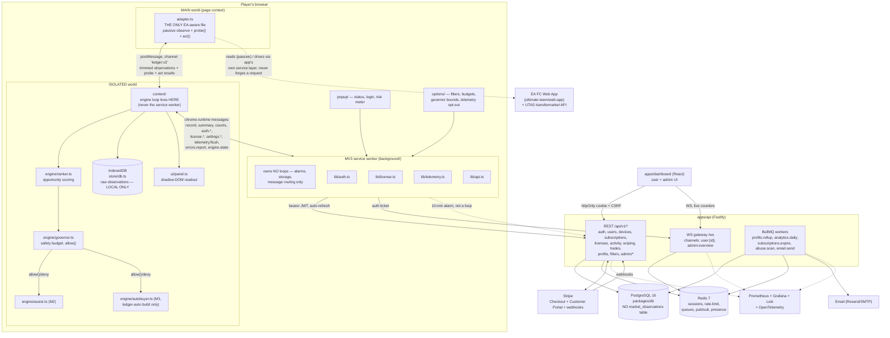
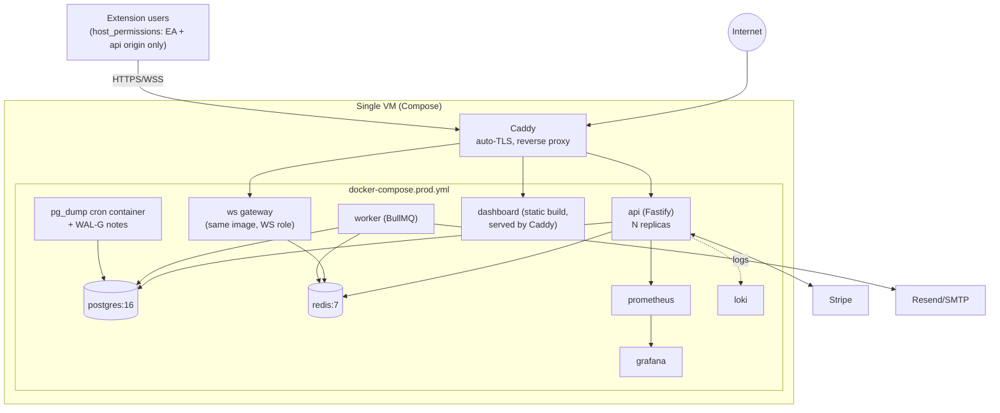
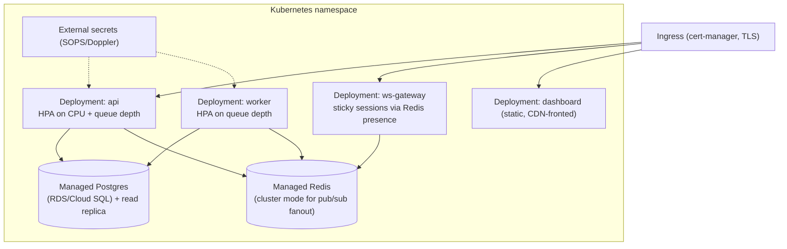
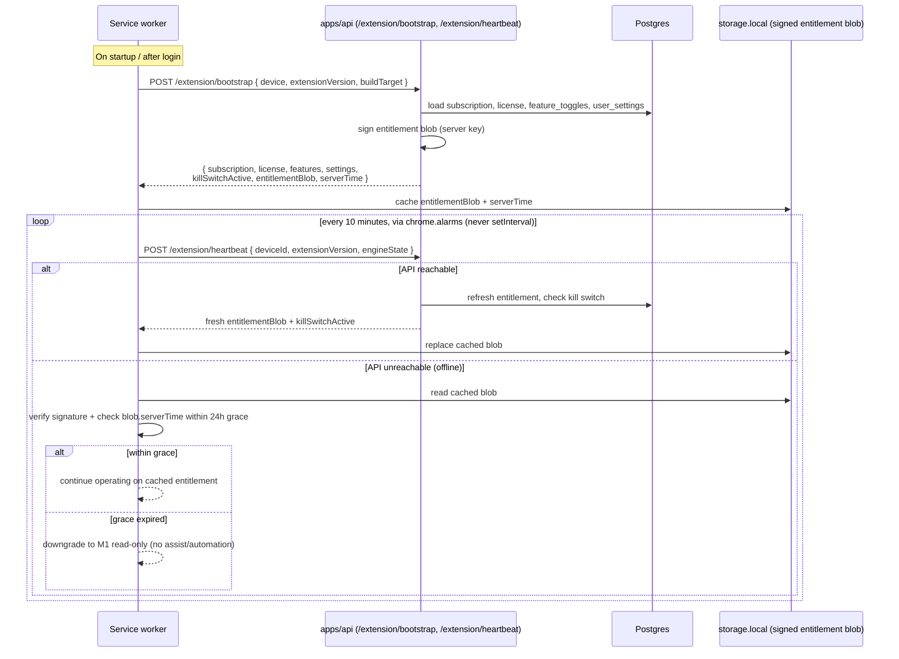
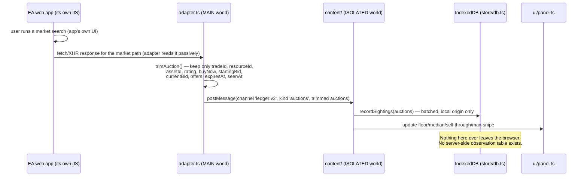
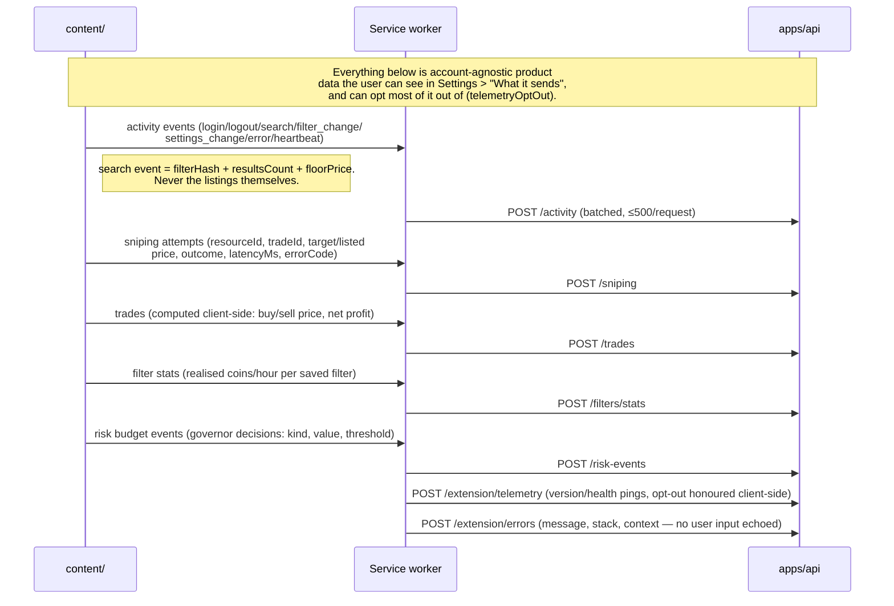
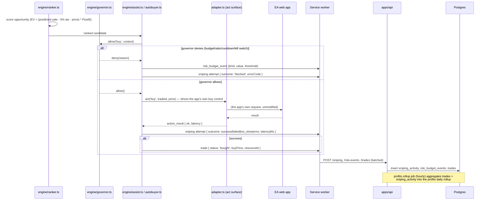
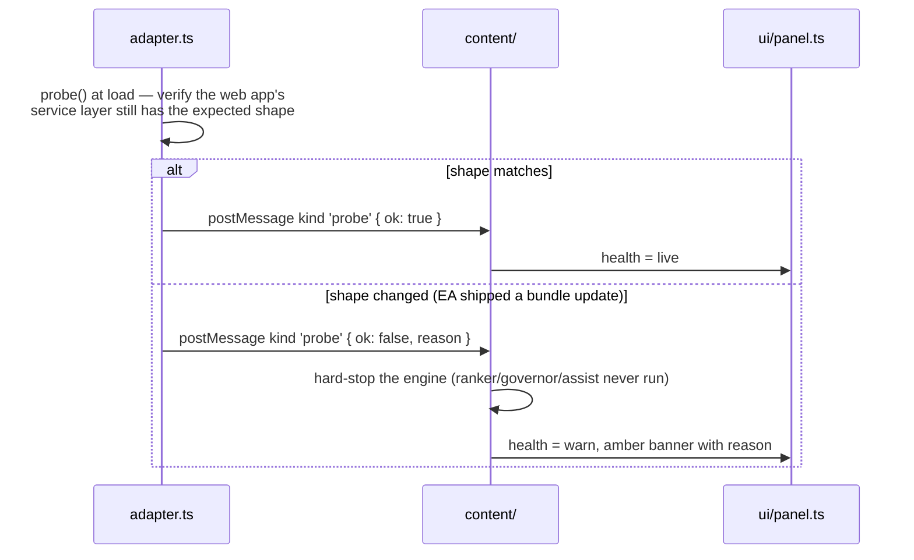
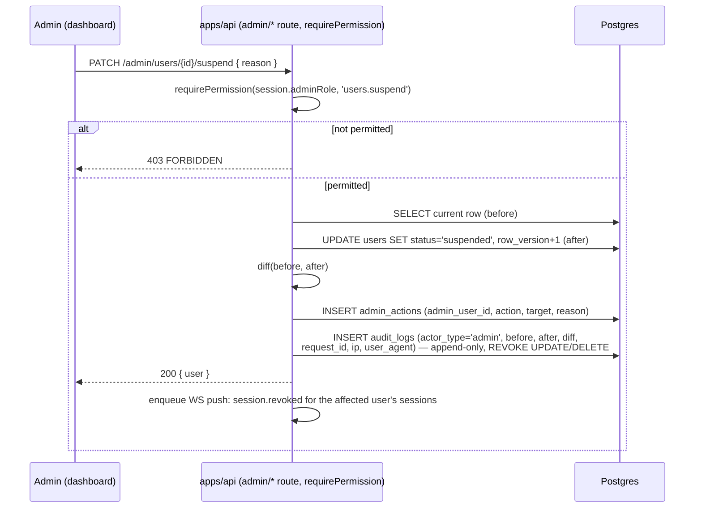
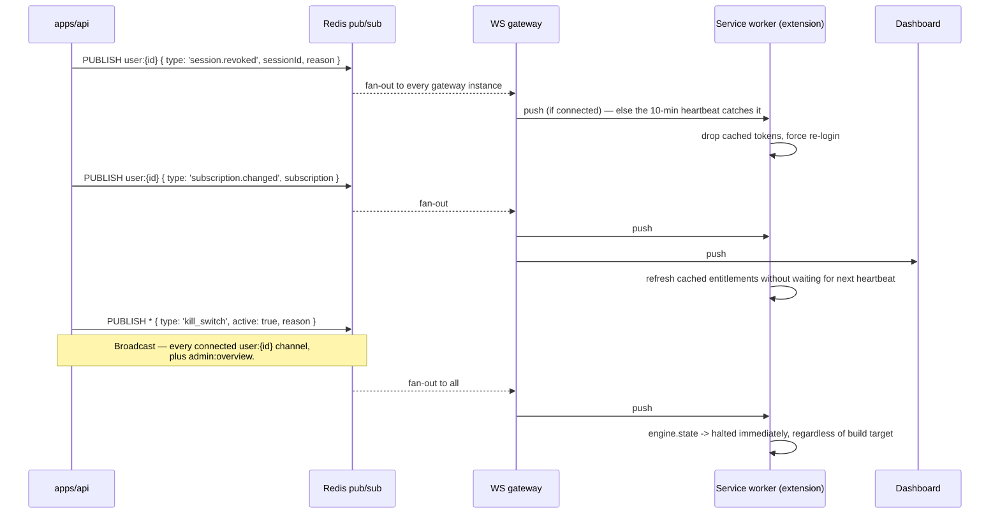

# 01 — Architecture

Status: implementation-ready for the phases it covers (architecture +
scaffolding, wave 0). Everything under `apps/api`, `apps/dashboard`,
`packages/db`, `packages/ui`, `infra/` and `tests/` is **designed** here and
**built** in later waves — see [`13-roadmap.md`](./13-roadmap.md) for the
phase-by-phase build order and exit criteria.

This document is the single place that shows how every piece of The
Sniper's Ledger fits together, what data is allowed to cross which boundary,
and why. Every other `docs/*.md` file goes deeper on one slice of this
picture; this one is the map.

## Contents

1. [Component diagram](#1-component-diagram)
2. [Deployment diagram](#2-deployment-diagram)
3. [Sequence diagrams](#3-sequence-diagrams)
4. [Data flow narrative](#4-data-flow-narrative)
5. [Trust boundaries](#5-trust-boundaries--what-crosses-each-one)
6. [Two extension build targets](#6-two-extension-build-targets)
7. [Scaling notes](#7-scaling-notes)
8. [Folder structure cross-reference](#8-folder-structure-cross-reference)

---

## 1. Component diagram



**Never-forge-a-request seam.** `adapter.ts` is the only file in the whole
system that knows anything about EA's internals — the same seam that shipped
in milestone 1. It reads market responses passively (patched
`fetch`/`XMLHttpRequest`) and, from M2 onward, drives the web app's own
service layer for `search`/`buy`/`readResult`. It never issues a request EA's
own UI wouldn't have issued, and it verifies its own assumptions on load with
`probe()` (§3.5).

## 2. Deployment diagram

### 2a. MVP: single VM, Docker Compose, Caddy



One VM is enough for the MVP's expected load (see §7). `docker-compose.yml`
is the dev stack (Postgres + Redis only, apps run with `pnpm dev`);
`docker-compose.prod.yml` adds Caddy, the built app images, and the
monitoring stack. Both are defined under `infra/docker/` (wave 4).

### 2b. Later shape: Kubernetes



Not built for this MVP (see `13-roadmap.md`'s go-live checklist and "out of
scope" list) — recorded here so the single-VM Compose setup doesn't paint
the API/worker/WS split into a corner. The split already matches: `apps/api`
exposes the REST app, the WS role, and the worker role from one codebase
(three process entry points, §8), so moving from "three Compose services of
one image" to "three K8s Deployments of one image" is a redeploy, not a
rewrite.

## 3. Sequence diagrams

### 3.1 Extension login + device registration

```mermaid
sequenceDiagram
    participant U as User (popup)
    participant SW as Service worker (lib/auth.ts)
    participant API as apps/api (/auth/*, /devices)
    participant Redis as Redis (rate limit, sessions)
    participant PG as Postgres

    U->>SW: submit email + password
    SW->>SW: compute device fingerprint (device/)
    SW->>API: POST /auth/login { email, password, device }
    API->>Redis: check IP + account rate limit / lockout
    alt locked out
        API-->>SW: 423 AUTH_ACCOUNT_LOCKED
    else credentials invalid
        API-->>SW: 401 AUTH_INVALID_CREDENTIALS
    else TOTP enabled
        API-->>SW: 200 { status: mfa_required, mfaTicket }
        SW->>U: prompt for 6-digit code
        U->>SW: code
        SW->>API: POST /auth/mfa/verify { mfaTicket, code }
    end
    API->>PG: verify device_limit for plan; evict oldest or reject
    alt over device_limit and no eviction policy
        API-->>SW: 409 DEVICE_LIMIT_REACHED
    else within limit
        API->>PG: insert/upsert devices row; insert sessions row (family_id)
        API-->>SW: 200 { accessToken (15m, EdDSA), refreshToken (opaque, 30d) }
    end
    SW->>SW: accessToken -> storage.session<br/>refreshToken (encrypted) -> storage.local
    SW-->>U: logged in
    SW->>API: POST /extension/bootstrap (see 3.2)
```

Device fingerprint, browser/OS and extension version are the only
device-identifying fields sent — never anything EA-specific. `sessions.family_id`
is what makes refresh-token rotation reuse-detectable: a reused refresh token
revokes the whole family (`AUTH_TOKEN_REUSED`).

### 3.2 License bootstrap + heartbeat + offline grace



The 24h offline grace exists so a transient network blip doesn't strand a
paying user mid-session; it is bounded specifically so a revoked/expired
license can't be used indefinitely offline. `killSwitchActive` is checked on
every successful heartbeat in addition to the WS push (§3.6) so a device that
missed the WS message still catches the kill switch within 10 minutes.

### 3.3a Market observation flow — stays local



### 3.3b Telemetry flow — what leaves the machine, itemised



The itemised list above **is** the trust-boundary contract for telemetry —
see §5 for the same list framed as "what crosses the boundary and why," and
`docs/06-extension.md` for the user-facing "What it sends" copy this maps
to 1:1.

### 3.4 Snipe attempt lifecycle



Every branch — including the blocked one — is reported, which is what lets
the dashboard's risk posture view (docs/08-analytics.md) show the governor
actually doing its job rather than just trusting that it did.

### 3.5 Adapter bundle probe (shape hard-stop)



This is the same "break loudly" contract milestone 1 already has for the
passive observation path (`kind: 'shape'`), extended to cover the `act`
surface before M2/M3 are allowed to use it at all.

### 3.6 Admin action → audit log



Every admin mutation schema (`adminActionRequestSchema` in `@sl/shared`)
requires a `reason`, so there is no code path that writes an `admin_actions`
row without one.

### 3.7 WS push: force logout, subscription change, kill switch



## 4. Data flow narrative

- **Recording (M1, always local).** The adapter watches the app's own
  network traffic, trims each auction to the model's inputs, and the content
  script writes it to the extension's own IndexedDB. No account is required
  for this to work at all — it is the same as today.
- **Product telemetry (M2+, account required).** Once logged in, the
  extension reports _about_ the user's activity — never the market data
  itself — in small, typed, batched POSTs (§3.3b). Every one of those event
  types is enumerated in `packages/shared/src/schemas/activity.ts` and
  friends; nothing ad-hoc gets appended without a schema change.
- **Entitlement (M2+).** Bootstrap/heartbeat is a pull (extension asks "am I
  still allowed"), the WS push is the complementary interrupt (server says
  "something changed, don't wait for the next heartbeat"). Both funnel into
  the same cached, signed entitlement blob so the engine has one source of
  truth for "can I run right now."
- **Action (M2 assist / M3 automation).** The ranker only ever proposes; the
  governor only ever allows or denies; the adapter only ever drives the
  app's own control. No component in this chain can skip the one before it
  — `assist.ts`/`autobuyer.ts` call `governor.allow()` before every single
  `adapter.act()`, not once per session.
- **Rollup.** Trades and sniping attempts land as raw rows; `profits.rollup`
  (hourly) and `analytics.daily` (nightly) are the only things that
  aggregate them, so the raw rows stay the audit trail and the rollups stay
  cheap to query.

## 5. Trust boundaries — what crosses each one

| Boundary                                      | Crosses                                                                                                                                                                                                                                                                            | Never crosses                                                                                                                |
| --------------------------------------------- | ---------------------------------------------------------------------------------------------------------------------------------------------------------------------------------------------------------------------------------------------------------------------------------- | ---------------------------------------------------------------------------------------------------------------------------- |
| **EA web app ↔ adapter.ts (MAIN world)**      | Nothing sent _to_ EA beyond what its own UI would already send. Read: market response bodies (passive).                                                                                                                                                                            | A forged/replayed request; a lifted session header used outside the app's own calls.                                         |
| **adapter.ts ↔ content script (postMessage)** | Trimmed auctions (`trimAuction` fields only — §3.3a), probe/shape status, action results.                                                                                                                                                                                          | The EA session token, club data, trade history, anything not explicitly copied by `trimAuction`.                             |
| **content/background ↔ IndexedDB**            | Raw + trimmed observations, local settings cache.                                                                                                                                                                                                                                  | Nothing leaves this boundary at all — it's the terminus, not a hop.                                                          |
| **Extension ↔ apps/api**                      | Auth (email + password/MFA code, never stored plaintext beyond the request), device fingerprint (opaque hash + browser/OS/ext version), activity metadata (§3.3b list, exhaustive), sniping attempts, trades, filter stats, risk events, telemetry/error pings, settings document. | Raw market listings, EA session/auth data, club contents, trade history from the game itself.                                |
| **apps/api ↔ Postgres**                       | Everything the API persists, always parameterised (Drizzle query builder or `sql.raw()` with constants — never `sql` template interpolation, enforced by the repo ESLint rule).                                                                                                    | Plaintext passwords (argon2id only), plaintext refresh tokens (hashed), plaintext TOTP secrets (pgcrypto column encryption). |
| **apps/api ↔ Stripe**                         | Checkout/portal session creation, webhook receipt (signature-verified).                                                                                                                                                                                                            | Full card data (Stripe-hosted Checkout/Portal only — PCI scope stays with Stripe).                                           |
| **apps/api ↔ Dashboard**                      | Everything a role's permission matrix allows (`@sl/shared` `hasPermission`), via httpOnly cookie + CSRF, never a bearer token in JS-readable storage.                                                                                                                              | Any admin surface without a `requirePermission` check; any user's data outside their own session's `user_id` scope.          |
| **host_permissions (extension manifest)**     | EA web-app origins + our own API origin. Nothing else.                                                                                                                                                                                                                             | Any third-party domain — there is no host permission that would let the extension talk to one.                               |

The one-line version: **raw market data has a trust boundary of exactly
one — the browser — and it never gets a second one.** Everything else that
does cross into the backend is listed exhaustively above and in
`docs/06-extension.md`'s "What it sends" page, which is the user-facing
mirror of this table.

## 6. Two extension build targets

|              | `ledger`                                                                                                | `ledger-auto`                                                                                                                  |
| ------------ | ------------------------------------------------------------------------------------------------------- | ------------------------------------------------------------------------------------------------------------------------------ |
| Contains     | M1 recorder + M2 assist                                                                                 | M1 + M2 + M3 automation (`engine/autobuyer.ts`)                                                                                |
| Distribution | Chrome Web Store (listable)                                                                             | Self-hosted (`update_url` points at our own update manifest, per CWS policy for tools that automate gameplay)                  |
| Build flag   | `VITE_AUTOMATION=0` (default)                                                                           | `VITE_AUTOMATION=1`                                                                                                            |
| Tree-shaking | `autobuyer.ts` and its manifest entries are excluded entirely — not just feature-flagged off at runtime | N/A (included)                                                                                                                 |
| Entitlement  | `automation.autobuyer` feature key is never granted meaning for this build                              | Still gated by `automation.autobuyer` (plan) **and** the governor at runtime — a build flag is distribution, not authorization |
| Governor     | Present and active (blocks nothing further to block)                                                    | Present, active, and the only thing standing between the ranker and `adapter.act()`                                            |

Both targets share every other file. The split happens at the Vite/crxjs
build config level (multi-entry, per-target manifest generation) — see
`docs/06-extension.md` for the exact build commands once that wave lands.

## 7. Scaling notes

- **Postgres partitioning.** `user_activity`, `search_activity`,
  `sniping_activity` and `audit_logs` are declaratively range-partitioned by
  month (see `docs/02-database.md` once `packages/db` lands). A BRIN index
  on the partition key (`occurred_at`) keeps insert-heavy, append-only
  tables cheap to write and to prune (old partitions are dropped, not
  deleted row-by-row).
- **Redis pub/sub fan-out.** The WS gateway is stateless per connection
  beyond "which `user:{id}`/`admin:overview` channels this socket
  subscribes to" — actual event delivery goes through Redis pub/sub so any
  gateway instance can receive an event from `apps/api` and push it to
  whichever instance holds that user's socket. This is what makes the WS
  gateway horizontally scalable without sticky-session tricks beyond what
  Redis presence already needs.
- **Workers.** BullMQ queues (`profits.rollup`, `analytics.daily`,
  `subscriptions.expire`, `licenses.revalidate`, `abuse.scan`,
  `email.send`, `audit.retention`) run in a separate process
  (`apps/api/src/worker.ts`) from the REST/WS process, so a slow analytics
  job never adds latency to a login request. Each queue scales
  independently by concurrency setting, not by adding API replicas.
- **Read path.** `analytics_daily` is a materialised KPI store precisely so
  the admin dashboard's overview never runs an aggregate query against
  `sniping_activity` directly — it reads a small, pre-computed table
  instead.
- **When to move to Kubernetes (§2b).** The single-VM Compose setup handles
  the MVP's expected load comfortably; the trigger to move is CPU/memory
  headroom on the VM under real traffic, not a fixed user count — tracked in
  `docs/13-roadmap.md`'s go-live checklist.

## 8. Folder structure cross-reference

```
apps/
  extension/   §1 (Browser subgraph), §6      — this repo, today
  api/         §1 (Backend subgraph), §7      — wave 2
  dashboard/   §1 (Dashboard), §3.6            — wave 3
packages/
  shared/      §3 (every payload shape), §5    — this repo, today
  config/      shared tsconfig/eslint/prettier — this repo, today
  db/          §2, §7 (partitioning)           — wave 1
  ui/          dashboard + popup/options theme — wave 5
infra/         §2a compose/Caddy, §2b K8s notes — wave 4
tests/         fixtures for §3's sequences      — wave 5
docs/          02–13, each expanding one section of this file
```
