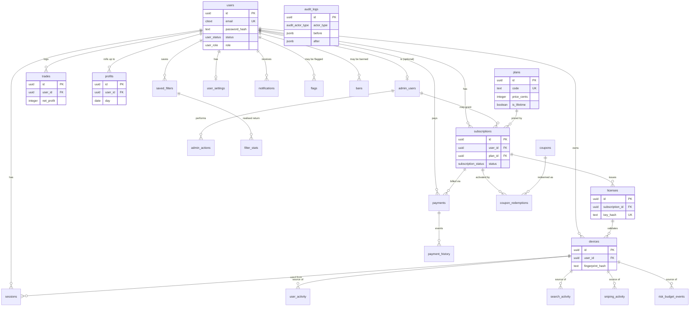

# 02 — Database

Status: implementation-ready. Everything described here exists as hand-written
SQL migrations in [`packages/db/migrations/`](../packages/db/migrations/),
a matching Drizzle ORM query layer in
[`packages/db/src/schema/`](../packages/db/src/schema/), a seed script, test
utilities, and a vitest suite that applies the migrations to a real Postgres
16 database and asserts every behaviour described below. See
[`01-architecture.md`](./01-architecture.md) for how this fits into the rest
of the system.

## Contents

1. [Conventions](#1-conventions)
2. [ERD](#2-erd)
3. [Why Drizzle is query-only](#3-why-drizzle-is-query-only)
4. [Migrator](#4-migrator)
5. [Roles and grants](#5-roles-and-grants)
6. [Table reference](#6-table-reference)
   - [Users & admin](#61-users--admin)
   - [Auth](#62-auth)
   - [Subscriptions & licensing](#63-subscriptions--licensing)
   - [Billing](#64-billing)
   - [Activity (partitioned telemetry)](#65-activity-partitioned-telemetry)
   - [Trading](#66-trading)
   - [Settings & notifications](#67-settings--notifications)
   - [Moderation](#68-moderation)
   - [Audit](#69-audit)
   - [System / feature flags / analytics](#610-system--feature-flags--analytics)
7. [Views and the materialized KPI store](#7-views-and-the-materialized-kpi-store)
8. [Partition maintenance runbook](#8-partition-maintenance-runbook)
9. [Backup / restore](#9-backup--restore)
10. [Seed data](#10-seed-data)
11. [Query patterns each index serves](#11-query-patterns-each-index-serves)

---

## 1. Conventions

Every table (unless noted otherwise) follows the same shape:

| Convention                  | Detail                                                                                                                                                                                                                                                                                                                                                                                                                                                                                                                                                                                                                                                          |
| --------------------------- | --------------------------------------------------------------------------------------------------------------------------------------------------------------------------------------------------------------------------------------------------------------------------------------------------------------------------------------------------------------------------------------------------------------------------------------------------------------------------------------------------------------------------------------------------------------------------------------------------------------------------------------------------------------- |
| Primary key                 | `id uuid primary key default gen_random_uuid()`. The application generates a `uuidv7` value at insert time so IDs are roughly time-ordered (better index locality than v4); the column default is `gen_random_uuid()` as a safety net for direct SQL/seed inserts.                                                                                                                                                                                                                                                                                                                                                                                              |
| `created_at` / `updated_at` | `timestamptz not null default now()`. `updated_at` is stamped by the `set_updated_at()` trigger (`migrations/0001`) — application code never sets it.                                                                                                                                                                                                                                                                                                                                                                                                                                                                                                           |
| `deleted_at`                | `timestamptz`, nullable. Soft delete: rows are never `DELETE`d by the application (except a handful of append-only / ephemeral-token tables noted per table). Every uniqueness constraint that must not collide with a soft-deleted row is a **partial unique index** `WHERE deleted_at IS NULL` ("unique among live rows").                                                                                                                                                                                                                                                                                                                                    |
| `row_version`               | `integer not null default 0`, incremented by the `bump_row_version()` trigger on every `UPDATE`. Used for optimistic concurrency (`UPDATE ... WHERE id = $1 AND row_version = $2`).                                                                                                                                                                                                                                                                                                                                                                                                                                                                             |
| `created_by` / `updated_by` | `uuid references users(id) on delete set null`, present only on tables that have a meaningful actor (mostly admin-managed tables: `plans`, `subscriptions`, `licenses`, `admin_users`, `coupons`).                                                                                                                                                                                                                                                                                                                                                                                                                                                              |
| Enums                       | Every closed set of states is a Postgres `ENUM` (`migrations/0002_enums.sql`), not a `text` + `CHECK`, so invalid values are rejected at the type level and `\dT+` self-documents the valid set.                                                                                                                                                                                                                                                                                                                                                                                                                                                                |
| Money                       | Always integer **cents** (`price_cents`, `amount_cents`), never floating point.                                                                                                                                                                                                                                                                                                                                                                                                                                                                                                                                                                                 |
| Game currency               | Always integer **coins** (`buy_price`, `coins_spent`, …), never floating point.                                                                                                                                                                                                                                                                                                                                                                                                                                                                                                                                                                                 |
| Foreign keys                | `ON DELETE` behaviour is chosen deliberately per relationship, not defaulted — see the per-table tables below. The three patterns used: **RESTRICT** (financial/entitlement rows — a user can't be hard-deleted while they still have subscriptions, licenses, payments, trades, coupon redemptions, or open fraud flags), **CASCADE** (pure child rows that have no meaning without their parent — devices, sessions, activity telemetry, settings, notifications), **SET NULL** (optional actor references — `granted_by_admin_id`, `issued_by`, `reviewed_by`, `updated_by`, and a few "nice to have but not load-bearing" links like `devices.license_id`). |
| Timestamps                  | Always `timestamptz`. Never bare `timestamp`.                                                                                                                                                                                                                                                                                                                                                                                                                                                                                                                                                                                                                   |

Naming: tables and columns are `snake_case`; the Drizzle layer maps every
column to `camelCase` (e.g. `price_cents` ↔ `priceCents`). Table names are
plural nouns. Junction/log tables read as `<subject>_<verb-ish noun>`
(`coupon_redemptions`, `admin_actions`, `payment_history`).

---

## 2. ERD



The full relational picture (35 tables) is too dense for one diagram to stay
readable; this ERD shows the spine. Every relationship, including the ones
omitted here for clarity (e.g. `flags.user_id`, `bans.user_id`,
`email_verifications.user_id`), is documented with its exact `ON DELETE`
behaviour in the [table reference](#6-table-reference) below.

---

## 3. Why Drizzle is query-only

Migrations are **hand-written SQL** in `packages/db/migrations/*.sql`,
applied by the small migrator in `src/migrate.ts` — not `drizzle-kit
generate`/`push`. Drizzle's schema (`src/schema/*.ts`) describes the same
tables for a fully-typed query builder (`db.select()`, `db.query.users.findFirst()`,
`InferSelectModel`/`InferInsertModel` types), but it never creates or alters
anything in the database.

Reasons:

- **Declarative partitioning** (`user_activity`, `search_activity`,
  `sniping_activity`, `audit_logs`) with a custom `create_month_partitions()`
  helper and a `DEFAULT` partition isn't something drizzle-kit's diffing
  represents.
- **Partial indexes** (`WHERE deleted_at IS NULL`), **BRIN** indexes on
  `occurred_at`, and **GIN** indexes on `jsonb` columns need hand-tuned
  `CREATE INDEX` statements drizzle-kit doesn't generate from the schema DSL.
- **Trigger functions** (`set_updated_at`, `bump_row_version`,
  `bump_users_row_version` — `users`'s own narrower variant, §6.1 —
  `reject_write`) and **views/materialized views** (`v_mrr`, `mv_kpi_daily`,
  …) are plain SQL objects Drizzle can only describe with `.existing()`, not
  create.
- **Role-based grants** (`app_rw`/`app_ro`, the `audit_logs` `REVOKE`) are a
  database-level security control that belongs in a reviewable, ordered SQL
  migration, not inferred from an ORM schema diff.
- Hand-written, numbered SQL files are also just easier to review in a PR and
  reason about in production incident response than a generated diff.

---

## 4. Migrator

`packages/db/src/migrate.ts` (`pnpm migrate`, `pnpm migrate:status`, `pnpm
migrate:down`):

- Reads every `*.sql` file in `migrations/`, sorted lexically (the `NNNN_`
  prefix controls order).
- Records each applied file in a `schema_migrations(filename, applied_at,
checksum)` table, created on first run.
- Applies each file **inside its own transaction** (`BEGIN` implied by
  `sql.begin(...)`) — a migration either fully applies or fully rolls back,
  and the `schema_migrations` row is inserted in the same transaction.
- Already-applied files are skipped; if a previously-applied file's on-disk
  content has changed, it warns loudly (migrations are meant to be immutable
  once applied — fix forward with a new numbered file).
- `down` rolls back the most-recently-applied migration using its
  best-effort counterpart in `migrations/down/` (see the header comment in
  each down file — some operations, like dropping a role still referenced
  elsewhere, are inherently best-effort).

Every migration filename maps 1:1 to a file in `migrations/down/` with the
same name, containing the reverse operation (mostly `DROP TABLE`/`DROP
TYPE`/`DROP FUNCTION`, `CASCADE` where dropping a partitioned parent should
take its partitions with it).

---

## 5. Roles and grants

Two database roles are created in `migrations/0001`:

- **`app_rw`** — the role the API and job workers connect as (or are
  members of). `SELECT`, `INSERT`, `UPDATE`, `DELETE` on every table
  **except** `audit_logs`, where `UPDATE`/`DELETE` are explicitly `REVOKE`d.
- **`app_ro`** — `SELECT` only, everywhere. For analytics/reporting
  connections and read replicas.

`migrations/0024_role_grants.sql` adds `ALTER DEFAULT PRIVILEGES` so any
table created by the same owning role in a _future_ migration automatically
grants the right access to both roles — except `audit_logs`-style
append-only tables, which must still explicitly `REVOKE` in their own
migration (defaults can't special-case one table).

---

## 6. Table reference

### 6.1 Users & admin

#### `users`

The account root. Case-insensitive email uniqueness (via `citext`) is
enforced only among live (`deleted_at IS NULL`) rows, so a deleted account's
email can be reused by a new signup.

| Column                                                  | Type                                | Notes                                                                                                                                                                                                               |
| ------------------------------------------------------- | ----------------------------------- | ------------------------------------------------------------------------------------------------------------------------------------------------------------------------------------------------------------------- |
| `id`                                                    | uuid PK                             |                                                                                                                                                                                                                     |
| `email`                                                 | citext                              | unique among live rows                                                                                                                                                                                              |
| `password_hash`                                         | text                                | argon2id                                                                                                                                                                                                            |
| `email_verified_at`                                     | timestamptz                         | null until verified                                                                                                                                                                                                 |
| `status`                                                | `user_status`                       | active / suspended / banned / deleted                                                                                                                                                                               |
| `role`                                                  | `user_role`                         | user / admin (coarse; fine-grained admin permissions live in `admin_users`)                                                                                                                                         |
| `totp_secret_enc`                                       | bytea                               | `pgp_sym_encrypt`-ed TOTP secret                                                                                                                                                                                    |
| `totp_enabled_at`                                       | timestamptz                         | null = 2FA off even if a secret exists                                                                                                                                                                              |
| `failed_login_count`                                    | smallint                            | drives lockout                                                                                                                                                                                                      |
| `locked_until`                                          | timestamptz                         | login rejected while `now() < locked_until`                                                                                                                                                                         |
| `last_login_at`, `last_ip`                              | timestamptz, inet                   |                                                                                                                                                                                                                     |
| `timezone`                                              | text                                | default `UTC`                                                                                                                                                                                                       |
| `referral_code`                                         | text                                | unique among live rows, format-checked                                                                                                                                                                              |
| `stripe_customer_id`                                    | text                                | (0025) unique among non-null values; the 4th trial-abuse vector (docs/05-subscriptions.md §5) — persisted the first time this user's Stripe Checkout completes or their Customer Portal session resolves a customer |
| `email_normalised`                                      | text, `GENERATED ALWAYS ... STORED` | (0025) SQL mirror of `normaliseEmailForAbuseCheck()`, indexed for the trial-abuse email check; never used for login/uniqueness                                                                                      |
| `deleted_at`, `created_at`, `updated_at`, `row_version` | —                                   | standard, but see `row_version`'s own note below                                                                                                                                                                    |

**Indexes:** partial unique on `email`; partial unique on `referral_code`;
unique on `stripe_customer_id` (non-null only); btree on `email_normalised`
(non-deleted only); partial btree on `status`, `role`, `last_login_at`;
btree on `created_at`.
**Constraints:** `failed_login_count >= 0`; `referral_code ~ '^[A-Z0-9]{4,16}$'`.
**Retention:** indefinite; soft-deleted rows are retained for financial/audit
integrity (subscriptions, payments etc. `RESTRICT` against hard delete).

**`row_version` is not the generic `bump_row_version()` trigger here** —
`users` is the one table with its own trigger function,
`bump_users_row_version()` (migrations/0026, docs/12-testing.md "Defects
found" #8). `row_version` backs every access token's `ver` claim
(`plugins/auth.ts` compares it on every authenticated request; a mismatch
forces re-login), so a write that bumps it invalidates every live session
for that user — appropriate for a password change, a role/status change, a
2FA change, or a soft-delete, not for `stripe_customer_id` being backfilled
by a Stripe webhook the account holder's own session had no part in (that
was the reported defect: checkout completing 401'd the buyer's own
already-open tab on their very next request). `bump_users_row_version()`
bumps on any change **except** to `stripe_customer_id` alone (an
exclude-list, not an allow-list of "security-relevant" columns — see the
migration's own header comment for why: two existing call sites,
`modules/auth/repo.ts`'s `bumpUserVersion()` — force-logout's enforcement,
which deliberately touches only `updated_at` to trigger a bump — and
`completeLogin()`'s `last_login_at`/`last_ip` bookkeeping, both depend on
"any `users` UPDATE bumps `row_version`" beyond just those named columns,
and a strict allow-list would have silently broken both).

#### `admin_users`

One row per user granted admin-panel access. `user_id` is `RESTRICT` —
can't hard-delete a user who's still an admin.

| Column                      | Type                                  | Notes                                     |
| --------------------------- | ------------------------------------- | ----------------------------------------- |
| `id`                        | uuid PK                               |                                           |
| `user_id`                   | uuid FK → users, **RESTRICT**, unique |                                           |
| `admin_role`                | `admin_role`                          | super_admin / support / analyst / billing |
| `permissions`               | jsonb                                 | override object layered on role defaults  |
| soft-delete + audit columns | —                                     | standard incl. `created_by`/`updated_by`  |

**Indexes:** partial btree on `admin_role`. **Constraints:** `permissions`
must be a JSON object.

#### `admin_actions`

Append-oriented (not hard-enforced like `audit_logs` — see
[§6.9](#69-audit) for why the two logs exist) log for the admin activity
screen.

| Column                      | Type                                | Notes                                                |
| --------------------------- | ----------------------------------- | ---------------------------------------------------- |
| `id`                        | uuid PK                             |                                                      |
| `admin_user_id`             | uuid FK → admin_users, **RESTRICT** |                                                      |
| `action`, `target_type`     | text                                | e.g. `"subscription.suspend"`, `"user"`              |
| `target_id`                 | uuid                                | nullable (bulk/config actions have no single target) |
| `reason`                    | text                                |                                                      |
| `metadata`                  | jsonb                               | action-specific detail                               |
| `occurred_at`, `created_at` | timestamptz                         | no `updated_at`/soft-delete — write-once             |

**Indexes:** `(admin_user_id, occurred_at desc)`, `(target_type,
target_id)`, `action`, `occurred_at desc`, GIN on `metadata`.

---

### 6.2 Auth

#### `devices`

Registered browser installs, for device-limit enforcement. Pure child of
`users` (**CASCADE**); `license_id` is an optional pointer to the license
currently validating it (**SET NULL**).

| Column                                       | Type                             | Notes                                                                     |
| -------------------------------------------- | -------------------------------- | ------------------------------------------------------------------------- |
| `id`                                         | uuid PK                          |                                                                           |
| `user_id`                                    | uuid FK → users, **CASCADE**     |                                                                           |
| `license_id`                                 | uuid FK → licenses, **SET NULL** |                                                                           |
| `fingerprint_hash`                           | text                             | hash of a stable client fingerprint                                       |
| `name`, `browser`, `os`, `extension_version` | text                             |                                                                           |
| `first_seen_at`, `last_seen_at`, `last_ip`   | —                                |                                                                           |
| `status`                                     | `device_status`                  | active / revoked                                                          |
| `trusted_at`                                 | timestamptz                      | reserved for step-up flows                                                |
| soft-delete + audit                          | —                                | standard (no `created_by`/`updated_by` — no meaningful third-party actor) |

**Indexes:** partial unique `(user_id, fingerprint_hash)`; partial btree on
`user_id`, `license_id`, `status`; btree on `last_seen_at`.
**Constraints:** `last_seen_at >= first_seen_at`.

#### `sessions`

Opaque refresh-token sessions (access tokens are stateless JWTs, never
persisted). Pure child of `users` (**CASCADE**); `device_id` **SET NULL**.

| Column                                                       | Type                  | Notes                                                                                   |
| ------------------------------------------------------------ | --------------------- | --------------------------------------------------------------------------------------- |
| `id`                                                         | uuid PK               |                                                                                         |
| `user_id`                                                    | uuid FK, **CASCADE**  |                                                                                         |
| `device_id`                                                  | uuid FK, **SET NULL** |                                                                                         |
| `refresh_token_hash`                                         | text unique           | SHA-256 of the 32-byte token                                                            |
| `family_id`                                                  | uuid                  | shared across a rotation chain — a reused stale token revokes the whole family          |
| `ip`, `user_agent`                                           | —                     |                                                                                         |
| `expires_at`, `revoked_at`, `revoked_reason`, `last_used_at` | —                     |                                                                                         |
| `created_at`, `updated_at`, `row_version`                    | —                     | no soft-delete — `revoked_at` is the terminal state; rows are pruned by a retention job |

**Indexes:** unique on `refresh_token_hash`; btree on `user_id`,
`device_id`, `family_id`; partial `(user_id, expires_at) WHERE revoked_at IS
NULL`. **Constraints:** `expires_at > created_at`.

#### `email_verifications` / `password_resets` / `totp_recovery_codes`

Short-lived, single-use, hash-only tokens. All **CASCADE** on `users`, no
soft-delete (ephemeral).

| Table                 | Key columns                                                      | TTL / use                                                |
| --------------------- | ---------------------------------------------------------------- | -------------------------------------------------------- |
| `email_verifications` | `token_hash` unique, `expires_at`, `consumed_at`                 | 24h, single use                                          |
| `password_resets`     | `token_hash` unique, `expires_at`, `consumed_at`, `requested_ip` | 1h, single use; success revokes all sessions (app layer) |
| `totp_recovery_codes` | `code_hash` unique, `used_at`                                    | 10 generated per user at 2FA enrolment                   |

---

### 6.3 Subscriptions & licensing

#### `plans`

Data-driven catalogue — admins can create plans (including one-off lifetime
plans) without a deploy.

| Column                    | Type     | Notes                                            |
| ------------------------- | -------- | ------------------------------------------------ |
| `id`                      | uuid PK  |                                                  |
| `code`                    | text     | unique among live rows, e.g. `trial`, `ultimate` |
| `name`, `description`     | text     |                                                  |
| `price_cents`             | integer  | 0 for trial                                      |
| `currency`                | text     | default `usd`                                    |
| `interval`                | text     | `day`/`week`/`month`/`year`/`one_time`           |
| `is_lifetime`             | boolean  |                                                  |
| `device_limit`            | smallint | 1–10                                             |
| `features`                | jsonb    | feature-flag object                              |
| `stripe_price_id`         | text     | null for manual/lifetime/coupon-only plans       |
| `is_active`, `sort_order` | —        |                                                  |
| soft-delete + audit       | —        | standard incl. `created_by`/`updated_by`         |

**Constraints:** `price_cents >= 0`; `device_limit BETWEEN 1 AND 10`;
`interval` in the five allowed values; a lifetime plan must have
`interval = 'one_time'` and vice versa. **Indexes:** partial unique `code`,
partial unique `stripe_price_id`, partial btree `is_active`, GIN on
`features`.

#### `subscriptions`

A user's entitlement over time. **Local state is the source of truth**;
reconciled from Stripe by webhook + nightly sync. `user_id`/`plan_id` are
**RESTRICT** — financial/entitlement records are never silently orphaned.
`granted_by_admin_id` is **SET NULL** (optional actor).

| Column                               | Type                                | Notes                                                        |
| ------------------------------------ | ----------------------------------- | ------------------------------------------------------------ |
| `id`                                 | uuid PK                             |                                                              |
| `user_id`                            | uuid FK, **RESTRICT**               |                                                              |
| `plan_id`                            | uuid FK, **RESTRICT**               |                                                              |
| `status`                             | `subscription_status`               | trialing/active/past_due/canceled/suspended/expired/lifetime |
| `current_period_start/end`           | timestamptz                         |                                                              |
| `trial_ends_at`                      | timestamptz                         | only populated while `status = trialing`                     |
| `cancel_at_period_end`, `auto_renew` | boolean                             |                                                              |
| `stripe_subscription_id`             | text                                | unique; null unless `source = stripe`                        |
| `source`                             | `subscription_source`               | stripe / manual / coupon                                     |
| `granted_by_admin_id`                | uuid FK → admin_users, **SET NULL** |                                                              |
| `canceled_at`, `ended_at`            | —                                   |                                                              |
| soft-delete + audit                  | —                                   | standard incl. `created_by`/`updated_by`                     |

**Constraints:** `current_period_end > current_period_start` (when both
set); `trial_ends_at` only when `status = trialing`; `stripe_subscription_id`
only when `source = stripe`; `status = lifetime` implies `source IN
(manual, coupon)`. **Indexes:** unique `stripe_subscription_id`; **partial
unique on `user_id` where status is one of the "live" statuses** — a user
may have historical (canceled/expired) subscriptions but only one live one
at a time; partial btree on `user_id`, `plan_id`, `status`,
`current_period_end`, `trial_ends_at`.

#### `licenses`

Issued license keys, format `SL-XXXX-XXXX-XXXX-XXXX` (Crockford base32 +
checksum, generated in the API). Only the hash is stored.
`subscription_id`/`user_id` are **RESTRICT**.

| Column                                                            | Type                  | Notes                                              |
| ----------------------------------------------------------------- | --------------------- | -------------------------------------------------- |
| `id`                                                              | uuid PK               |                                                    |
| `subscription_id`                                                 | uuid FK, **RESTRICT** |                                                    |
| `user_id`                                                         | uuid FK, **RESTRICT** |                                                    |
| `key_hash`                                                        | text unique           | hash of the full key                               |
| `key_prefix`                                                      | text                  | non-secret display prefix                          |
| `status`                                                          | `license_status`      | active / revoked / expired                         |
| `max_devices`                                                     | smallint              | copied from `plans.device_limit` at issuance, 1–10 |
| `expires_at`, `last_validated_at`, `revoked_at`, `revoked_reason` | —                     |                                                    |
| soft-delete + audit                                               | —                     | standard                                           |

**Constraints:** `max_devices BETWEEN 1 AND 10`; `status = revoked` iff
`revoked_at IS NOT NULL`. **Indexes:** unique `key_hash`; partial btree on
`subscription_id`, `user_id`, `status`, `expires_at`; btree `key_prefix`.

---

### 6.4 Billing

#### `coupons` / `coupon_redemptions`

`coupons` created before `payments` in migration order since `payments`
references it.

| Table                | Key columns                                                                                                                                                                                            | Notes                                                                                                                           |
| -------------------- | ------------------------------------------------------------------------------------------------------------------------------------------------------------------------------------------------------ | ------------------------------------------------------------------------------------------------------------------------------- |
| `coupons`            | `code` (unique, live), `type` (`coupon_type`: percent/fixed/free_days/lifetime), `value`, `plan_ids uuid[]`, `max_redemptions`, `redeemed_count`, `expires_at`, `is_active`, `created_by` **SET NULL** | `value` range CHECK'd per `type` (percent 1–100, fixed/free_days ≥ 1, lifetime = 0 unused); `redeemed_count <= max_redemptions` |
| `coupon_redemptions` | `coupon_id` **RESTRICT**, `user_id` **RESTRICT**, `subscription_id` **SET NULL**, `redeemed_at`                                                                                                        | append-only; unique `(coupon_id, user_id)` — one redemption per coupon per user                                                 |

#### `payments` / `payment_history` / `stripe_webhook_events`

| Table                   | Key columns                                                                                                                                                                                           | Notes                                                         |
| ----------------------- | ----------------------------------------------------------------------------------------------------------------------------------------------------------------------------------------------------- | ------------------------------------------------------------- |
| `payments`              | `user_id` **RESTRICT**, `subscription_id` **RESTRICT**, `provider`, `provider_payment_id` (unique per provider — idempotency), `amount_cents >= 0`, `status`, `coupon_id` **SET NULL**, `invoice_url` | one row per charge/attempt                                    |
| `payment_history`       | `payment_id` **CASCADE**, `event`, `raw_event jsonb`, `occurred_at`                                                                                                                                   | append-only event trail per payment                           |
| `stripe_webhook_events` | `event_id` unique, `type`, `payload jsonb`, `processed_at`, `error`                                                                                                                                   | idempotency ledger — a re-delivered Stripe webhook is a no-op |

---

### 6.5 Activity (partitioned telemetry)

`user_activity`, `search_activity`, `sniping_activity` are **declaratively
range-partitioned by month** on `occurred_at`. See
[§8](#8-partition-maintenance-runbook). All three: pure child of `users`
(**CASCADE** — supports GDPR erasure), `device_id` **SET NULL**. Primary key
is `(id, occurred_at)` (partitioned tables require the partition key in
every unique constraint).

These carry only **account-agnostic product telemetry the user explicitly
opted into tracking** — never raw EA session/club/trade-history payloads
(project trust guarantee; see `docs/01-architecture.md` §5). There is
deliberately **no `market_observations` table** — raw listings stay in the
browser's IndexedDB, never uploaded, never pooled across users.

#### `user_activity`

| Column            | Type                  | Notes                                                                                                                                                                                  |
| ----------------- | --------------------- | -------------------------------------------------------------------------------------------------------------------------------------------------------------------------------------- |
| `id, occurred_at` | uuid, timestamptz     | composite PK                                                                                                                                                                           |
| `user_id`         | uuid FK, **CASCADE**  |                                                                                                                                                                                        |
| `device_id`       | uuid FK, **SET NULL** |                                                                                                                                                                                        |
| `type`            | `user_activity_type`  | login/logout/search/filter_change/settings_change/error/heartbeat/device_registered/device_revoked/password_changed/email_changed/mfa_enabled/mfa_disabled/kill_switch_triggered/other |
| `ip`              | inet                  |                                                                                                                                                                                        |
| `metadata`        | jsonb                 | type-specific payload                                                                                                                                                                  |

**Indexes:** `(user_id, occurred_at desc)`, `(device_id, occurred_at desc)`,
`(type, occurred_at desc)`, **BRIN** on `occurred_at`, **GIN** on
`metadata`.

#### `search_activity`

Search _metadata_ only (filter hash/shape, result count, observed floor
price) — never the raw listing set.

| Column                 | Type                 | Notes                                     |
| ---------------------- | -------------------- | ----------------------------------------- |
| `id, occurred_at`      | —                    | composite PK                              |
| `user_id`, `device_id` | —                    | CASCADE / SET NULL                        |
| `filter_hash`          | text                 | correlates to `saved_filters.filter_hash` |
| `filter`               | jsonb                |                                           |
| `results_count`        | integer, ≥ 0         |                                           |
| `resource_id`          | text                 | EA player/item resource, if applicable    |
| `floor_price`          | integer, ≥ 0 or null |                                           |

**Indexes:** `(user_id, occurred_at desc)`, `(device_id, occurred_at desc)`,
`(filter_hash, occurred_at desc)`, `(resource_id, occurred_at desc)`, BRIN,
GIN on `filter`.

#### `sniping_activity`

One row per snipe attempt outcome, computed by the extension.

| Column                         | Type              | Notes                                                                            |
| ------------------------------ | ----------------- | -------------------------------------------------------------------------------- |
| `id, occurred_at`              | —                 | composite PK                                                                     |
| `user_id`, `device_id`         | —                 | CASCADE / SET NULL                                                               |
| `resource_id`, `trade_id`      | text              | `trade_id` correlates to `trades.trade_id` on success                            |
| `target_price`, `listed_price` | integer, ≥ 0      |                                                                                  |
| `outcome`                      | `sniping_outcome` | attempted/success/failed/too_slow/blocked/error — `blocked` = governor denied it |
| `latency_ms`, `error_code`     | —                 |                                                                                  |

**Indexes:** `(user_id, occurred_at desc)`, `(device_id, occurred_at desc)`,
`(resource_id, occurred_at desc)`, partial `trade_id`, `(outcome,
occurred_at desc)`, BRIN.

#### `risk_budget_events`

Safety-governor decisions (actions/hour, session length, buy:search ratio,
coin flow, hard stop, kill switch), synced from the extension. **Not** one
of the four declaratively-partitioned tables (not high-enough volume to
warrant it at MVP scale) — a plain table with a BRIN index on `occurred_at`.

| Column                      | Type                  | Notes                                                                            |
| --------------------------- | --------------------- | -------------------------------------------------------------------------------- |
| `id`                        | uuid PK               |                                                                                  |
| `user_id`                   | uuid FK, **CASCADE**  |                                                                                  |
| `device_id`, `session_id`   | uuid FK, **SET NULL** |                                                                                  |
| `kind`                      | `risk_event_kind`     | actions_per_hour/session_length/buy_search_ratio/coin_flow/hard_stop/kill_switch |
| `value`, `threshold`        | numeric(14,4)         | observed value vs. configured threshold                                          |
| `occurred_at`, `created_at` | —                     |                                                                                  |

**Indexes:** `(user_id, occurred_at desc)`, `(device_id, occurred_at desc)`,
`session_id`, `(kind, occurred_at desc)`, BRIN.

---

### 6.6 Trading

#### `trades`

Individual buy→sell trades, computed and reported by the user's own
extension. Financial record: `user_id` **RESTRICT**.

| Column                                            | Type                                                      | Notes                                               |
| ------------------------------------------------- | --------------------------------------------------------- | --------------------------------------------------- |
| `id`                                              | uuid PK                                                   |                                                     |
| `user_id`                                         | uuid FK, **RESTRICT**                                     |                                                     |
| `trade_id`                                        | text                                                      | extension-generated id, unique per user (live rows) |
| `resource_id`, `asset_id`                         | text                                                      |                                                     |
| `rating`                                          | smallint, 0–99                                            |                                                     |
| `buy_price`, `sell_price`, `ea_tax`, `net_profit` | integer, ≥ 0 (except `net_profit`, which can be negative) | coins                                               |
| `status`                                          | `trade_status`                                            | bought/listed/sold/expired/unsold                   |
| `bought_at`, `sold_at`                            | —                                                         | `sold_at >= bought_at`                              |
| soft-delete + audit                               | —                                                         | standard, no `created_by`/`updated_by`              |

**Indexes:** partial unique `(user_id, trade_id)`; partial btree `user_id`,
`resource_id`, `status`; partial `(user_id, sold_at) WHERE sold_at IS NOT
NULL`.

#### `profits`

Daily per-user rollup, maintained by the `profits.rollup` hourly job
(upsert on `(user_id, day)`). Financial record: `user_id` **RESTRICT**.

| Column                                      | Type                                   | Notes                 |
| ------------------------------------------- | -------------------------------------- | --------------------- |
| `id`                                        | uuid PK                                |                       |
| `user_id`                                   | uuid FK, **RESTRICT**                  |                       |
| `day`                                       | date                                   | unique with `user_id` |
| `coins_spent`, `coins_earned`, `net_profit` | bigint, ≥ 0 (net_profit unconstrained) |                       |
| `snipes`, `successes`, `trades_closed`      | integer, ≥ 0; `successes <= snipes`    |                       |

**Indexes:** unique `(user_id, day)`; btree `day`; `(user_id, day desc)`.

#### `saved_filters` / `filter_stats`

The opportunity ranker's persisted filters and their realised-return
history, synced from the extension so they survive reinstalls. Both
**CASCADE** on their parent.

| Table           | Key columns                                                                                                                                                                       | Notes                               |
| --------------- | --------------------------------------------------------------------------------------------------------------------------------------------------------------------------------- | ----------------------------------- |
| `saved_filters` | `user_id` **CASCADE**, `name`, `filter jsonb`, `filter_hash` (unique per user, live), `is_active`, `sort_order`                                                                   |                                     |
| `filter_stats`  | `filter_id` **CASCADE**, `window_start` (unique with `filter_id`), `searches`, `attempts`, `successes <= attempts`, `coins_spent`, `coins_earned`, `coins_per_hour numeric(14,2)` | the ranker's primary scoring signal |

---

### 6.7 Settings & notifications

| Table              | Key columns                                                                                                                             | Notes                                                                                                                             |
| ------------------ | --------------------------------------------------------------------------------------------------------------------------------------- | --------------------------------------------------------------------------------------------------------------------------------- |
| `user_settings`    | `user_id` **CASCADE**, unique; `settings jsonb`, `version`                                                                              | current settings blob, validated by the shared Zod schema at the API boundary (not the DB); server version wins on sync conflicts |
| `settings_history` | `user_id` **CASCADE**; `settings jsonb`, `version` (unique with `user_id`), `changed_by` **SET NULL**                                   | append-only snapshot on every change                                                                                              |
| `notifications`    | `user_id` **CASCADE**; `type`, `title`, `body`, `data jsonb`, `read_at`, `delivered_via` (`notification_channel`: in_app/email/push/ws) |                                                                                                                                   |

---

### 6.8 Moderation

#### `bans`

`user_id` **SET NULL** (an IP/device/hwid ban must survive account
deletion); `issued_by` **SET NULL**.

| Column                    | Type                            | Notes                                  |
| ------------------------- | ------------------------------- | -------------------------------------- |
| `id`                      | uuid PK                         |                                        |
| `user_id`                 | uuid FK, **SET NULL**, nullable | required (CHECK) when `type = account` |
| `type`                    | `ban_type`                      | account / ip / device / hwid           |
| `value`                   | text                            | the banned identifier itself           |
| `reason`                  | text                            |                                        |
| `issued_by`               | uuid FK → users, **SET NULL**   |                                        |
| `expires_at`, `lifted_at` | —                               | null `expires_at` = indefinite         |

**Indexes:** partial (`liftedAt IS NULL`) on `user_id`, `(type, value)`,
`expires_at`.

#### `flags`

Abuse/fraud flags from the `abuse.scan` job or an admin. `user_id`
**RESTRICT** — a flag is evidence, must not be silently lost. `reviewed_by`
**SET NULL**.

| Column                       | Type                  | Notes                                                                         |
| ---------------------------- | --------------------- | ----------------------------------------------------------------------------- |
| `id`                         | uuid PK               |                                                                               |
| `user_id`                    | uuid FK, **RESTRICT** |                                                                               |
| `kind`                       | `flag_kind`           | trial_abuse/multi_account/velocity/chargeback/suspicious_ip                   |
| `severity`                   | `flag_severity`       | low/medium/high/critical                                                      |
| `evidence`                   | jsonb                 |                                                                               |
| `status`                     | `flag_status`         | open/reviewed/dismissed — `reviewed_at` set exactly when status leaves `open` |
| `reviewed_by`, `reviewed_at` | —                     |                                                                               |

---

### 6.9 Audit

#### `audit_logs`

Append-only, before/after-diffing audit trail for every mutating request
(admin **and** non-admin). Declaratively partitioned by month on
`occurred_at`, PK `(id, occurred_at)`.

**Why two logs exist:** `admin_actions` (§6.1) is a lightweight,
query-optimised feed for the admin "recent actions" screen, written directly
by the admin API. `audit_logs` is the hard-enforced, general-purpose,
before/after diffing trail for _every_ mutating request across the whole
system (not just admin ones), and is the one with database-level tamper
resistance.

| Column                           | Type               | Notes                                                                                                          |
| -------------------------------- | ------------------ | -------------------------------------------------------------------------------------------------------------- |
| `id, occurred_at`                | —                  | composite PK                                                                                                   |
| `actor_type`                     | `audit_actor_type` | user / admin / system                                                                                          |
| `actor_id`                       | uuid, no FK        | polymorphic (points into `users` or `admin_users`); null only if `actor_type = system`                         |
| `action`, `entity_type`          | text               |                                                                                                                |
| `entity_id`                      | uuid, no FK        | polymorphic; deliberately no FK on `actor_id`/`entity_id` — the audit trail must outlive the rows it describes |
| `before`, `after`, `diff`        | jsonb              |                                                                                                                |
| `ip`, `user_agent`, `request_id` | —                  | `request_id` correlates to the API's `x-request-id`                                                            |

**Append-only, enforced two ways:**

1. **Grant-level:** `app_rw` (the API/worker role) is granted only `SELECT,
INSERT` on `audit_logs`; `UPDATE`/`DELETE` are explicitly `REVOKE`d
   (`app_ro` never had them). A compromised or buggy API process physically
   cannot alter history.
2. **Trigger-level:** a `BEFORE UPDATE OR DELETE` trigger
   (`reject_write()`) unconditionally raises, as a second line of defense
   for any role/session that _does_ hold the privilege (e.g. manual
   superuser maintenance without due care).

Both are covered by `test/audit-logs.test.ts`.

**Indexes:** `(actor_type, actor_id, occurred_at desc)`, `(entity_type,
entity_id, occurred_at desc)`, `(action, occurred_at desc)`, `request_id`,
**BRIN** on `occurred_at`, **GIN** on `diff`.

---

### 6.10 System / feature flags / analytics

| Table                | Key columns                                                                                                                                    | Notes                                                                                                                                                                                                                               |
| -------------------- | ---------------------------------------------------------------------------------------------------------------------------------------------- | ----------------------------------------------------------------------------------------------------------------------------------------------------------------------------------------------------------------------------------- |
| `feature_toggles`    | `key` unique, `enabled`, `rollout_percent 0–100`, `plan_gate text[]`, `user_allowlist uuid[]`, `updated_by`                                    | seeded: `automation.enabled`, `kill_switch`, `telemetry.enabled`, `trial.enabled`, `hibp_check` — see [§10](#10-seed-data)                                                                                                          |
| `system_config`      | `key` unique, `value jsonb`, `is_secret`, `updated_by`                                                                                         | seeded: safety-governor defaults (`governor.max_actions_per_hour`, `governor.max_session_minutes`, `governor.max_buy_search_ratio`, `governor.max_coin_flow_per_hour`), `device_limits`, `offline_grace_hours`, `heartbeat_minutes` |
| `ip_activity`        | `ip`, `user_id` **SET NULL**, `device_id` **SET NULL**, `country`, `asn`, `first_seen`, `last_seen`, `request_count`, `flagged`                | rolling per-(ip,user) counters for impossible-travel/velocity flagging; unique `(ip, user_id)` with `NULLS NOT DISTINCT`                                                                                                            |
| `extension_installs` | `install_id` unique, `user_id` **SET NULL** (nullable — pre-login installs), `version`, `browser`, `first_seen`, `last_seen`, `uninstalled_at` | install counts, version distribution                                                                                                                                                                                                |
| `analytics_daily`    | `day`, `metric`, `dimension` (default `''`), `value numeric(18,4)`                                                                             | generic KPI store, unique `(day, metric, dimension)`, populated by the `analytics.daily` nightly job; every metric's formula is defined in `docs/08-analytics.md`                                                                   |

---

## 7. Views and the materialized KPI store

| Object                   | Formula                                                                                                                                                                                                                                                                                                                                                                                                                                                                                                                                                                                       |
| ------------------------ | --------------------------------------------------------------------------------------------------------------------------------------------------------------------------------------------------------------------------------------------------------------------------------------------------------------------------------------------------------------------------------------------------------------------------------------------------------------------------------------------------------------------------------------------------------------------------------------------- |
| `v_active_subscriptions` | All subscriptions with `status IN (trialing, active, past_due, suspended, lifetime)`, joined to their plan.                                                                                                                                                                                                                                                                                                                                                                                                                                                                                   |
| `v_mrr`                  | `SUM` over active, **non-lifetime** subscriptions of the plan price **normalised to monthly**: `month` price as-is, `year` price ÷ 12, `week` price × 4.345, `day` price × 30.44 (average weeks/days per month). Trialing/past_due/suspended/canceled/expired and lifetime plans contribute 0.                                                                                                                                                                                                                                                                                                |
| `v_arr`                  | `v_mrr.mrr_cents × 12`.                                                                                                                                                                                                                                                                                                                                                                                                                                                                                                                                                                       |
| `v_user_lifetime_profit` | Per-user `SUM` of every column in `profits`, grouped by `user_id`, plus `MIN`/`MAX(day)`.                                                                                                                                                                                                                                                                                                                                                                                                                                                                                                     |
| `v_daily_profit`         | Platform-wide `SUM` of `profits`, grouped by `day`, plus `COUNT(DISTINCT user_id)` as `active_traders`. Backs the admin date-range profit charts.                                                                                                                                                                                                                                                                                                                                                                                                                                             |
| `mv_kpi_daily`           | **Materialized.** One row per calendar day from the earliest `profits.day` (or today, if empty) through today: `new_users` (from `users.created_at`), `active_users` (`COUNT(DISTINCT user_id)` from `user_activity`), `net_profit_cents`/`snipes`/`successes` (from `profits`), `revenue_cents` (`SUM(amount_cents)` from `payments WHERE status = 'succeeded'`). Refreshed via `SELECT refresh_mv_kpi_daily();`, which uses `REFRESH MATERIALIZED VIEW CONCURRENTLY` (needs — and has — a unique index on `day`) so readers are never blocked. Called by the `analytics.daily` nightly job. |

All are verified against seeded fixture data in `test/views.test.ts`
(`v_mrr`/`v_arr`).

---

## 8. Partition maintenance runbook

`user_activity`, `search_activity`, `sniping_activity`, and `audit_logs` are
`PARTITION BY RANGE (occurred_at)`, one partition per calendar month, named
`<table>_yYYYY_mMM` — e.g. `user_activity_y2026m09`. Every partitioned table
also has a `<table>_default` `DEFAULT` partition that silently catches any
row outside the declared monthly ranges, so an insert never fails just
because a partition wasn't pre-created — but it also means a `_default`
partition growing large is a signal maintenance is overdue.

**Creating a partition:** the generic helper function
`create_month_partitions(parent text, from_month date, months int)`
(`migrations/0001`) creates `months` consecutive monthly partitions of
`parent` starting at `from_month` (truncated to the 1st). It's idempotent
(`CREATE TABLE IF NOT EXISTS`). Initial migrations call it with `months =
13` (current month + 12 ahead) for each of the four tables.

**Ongoing maintenance (not yet automated — tracked in `docs/13-roadmap.md`):**
run, e.g. monthly via a scheduled job or manual runbook step:

```sql
SELECT create_month_partitions('user_activity', date_trunc('month', now())::date, 13);
SELECT create_month_partitions('search_activity', date_trunc('month', now())::date, 13);
SELECT create_month_partitions('sniping_activity', date_trunc('month', now())::date, 13);
SELECT create_month_partitions('audit_logs', date_trunc('month', now())::date, 13);
```

This is safe to run at any cadence — existing partitions are left alone,
only missing months in the requested range are created — so "run it monthly
and always keep ~12 months of headroom" is a reasonable default. A future
`partitions.maintain` BullMQ job (see `docs/13-roadmap.md`) should call this
on a schedule instead of a human remembering to.

**Dropping old partitions** (once a retention policy is decided — not
implemented yet): `DROP TABLE <table>_yYYYY_mMM;` on a partition detaches
and drops it in one nearly-instant operation (no row-by-row `DELETE`), which
is the main operational reason to partition high-volume telemetry tables at
all.

**Verified by** `test/schema.test.ts` (every partitioned table has ≥13
monthly partitions + a default) and `test/partitions.test.ts` (a row with an
in-range `occurred_at` lands in the matching monthly partition; a row with
an out-of-range `occurred_at` lands in `_default`).

---

## 9. Backup / restore

Full operational detail (schedule, retention, `pg_dump`/WAL-G, restore
drill) is DevOps' responsibility and lands in `docs/11-devops.md` (wave 4).
What matters here, at the schema level:

- Every table uses soft delete (`deleted_at`) rather than hard delete, so a
  logical "undo" of a mistaken delete is a single `UPDATE ... SET deleted_at
= NULL` for most tables — no restore-from-backup needed for that class of
  mistake.
- `audit_logs` (and `admin_actions`) exist specifically so "what changed and
  who did it" survives independently of whatever a restore recovers.
- Partitioned tables restore/back up per-partition-friendly (a `pg_dump` of
  one month's partition is a bounded, independent unit), which matters for
  the eventual retention/archival policy.

---

## 10. Seed data

`packages/db/src/seed.ts` (`pnpm seed`), fully idempotent — every entity is
looked up by its natural key and updated in place rather than re-inserted,
verified by `test/seed.test.ts` running it twice and asserting no
duplicates:

- **Plans:** `trial` (0¢/mo, 1 device), `basic` (499¢/mo, 1 device), `pro`
  (999¢/mo, 2 devices), `ultimate` (1999¢/mo, 3 devices, automation feature
  flag on), `lifetime` (9999¢ one-time, `is_lifetime = true`, 3 devices).
- **Feature toggles:** `automation.enabled=false`, `kill_switch=false`,
  `telemetry.enabled=true`, `trial.enabled=true`, `hibp_check=false`. Once a
  toggle exists, re-running seed **leaves its current value alone**
  (admin-controlled from that point on) rather than resetting it.
- **System config (safety-governor defaults):**
  `governor.max_actions_per_hour=90`, `governor.max_session_minutes=120`,
  `governor.max_buy_search_ratio=0.35`, `governor.max_coin_flow_per_hour=200000`,
  `device_limits` (plan-code → limit map), `offline_grace_hours=24`,
  `heartbeat_minutes=10`. Same "don't clobber an admin's tuned value" rule
  as feature toggles.
- **Super admin:** from `SEED_ADMIN_EMAIL`/`SEED_ADMIN_PASSWORD` env vars
  (argon2id-hashed), `role=admin`, `admin_users.admin_role=super_admin`.
  Skipped with a warning if either env var is unset.
- **Dev user:** `dev@sniperledger.local`, only when `NODE_ENV !=
production`.

---

## 11. Query patterns each index serves

| Index                                                                              | Query it serves                                                                                                                                                                    |
| ---------------------------------------------------------------------------------- | ---------------------------------------------------------------------------------------------------------------------------------------------------------------------------------- |
| `users_email_unique_live`                                                          | Login lookup by email; registration uniqueness check.                                                                                                                              |
| `users_status_idx`, `users_role_idx`                                               | Admin user list filters ("show suspended users", "show admins").                                                                                                                   |
| `subscriptions_one_live_per_user`                                                  | Enforces + fast-checks "does this user already have a live subscription" at checkout/grant time.                                                                                   |
| `subscriptions_current_period_end_idx`                                             | The `subscriptions.expire` job's "find subscriptions whose period just ended" sweep.                                                                                               |
| `subscriptions_trial_ends_at_idx`                                                  | Trial-expiry sweep and "trial ending soon" notification job.                                                                                                                       |
| `licenses_expires_at_idx`                                                          | License-expiry sweep.                                                                                                                                                              |
| `licenses_key_prefix_idx`                                                          | Support lookup by the displayed key prefix without ever handling the full key.                                                                                                     |
| `devices_user_fingerprint_unique_live`                                             | Device-limit enforcement at login (is this fingerprint already registered for this user?).                                                                                         |
| `sessions_family_id_idx`                                                           | Refresh-token reuse detection — revoke the whole rotation family.                                                                                                                  |
| `sessions_active_idx`                                                              | "Force logout" / active-session listing per user.                                                                                                                                  |
| `user_activity`/`search_activity`/`sniping_activity` `(user_id, occurred_at desc)` | Per-user activity timeline (dashboard "recent activity", support investigation).                                                                                                   |
| `*_occurred_at_brin`                                                               | Admin analytics date-range scans across a whole partitioned table — BRIN is cheap to maintain and effective because rows are naturally time-ordered within each monthly partition. |
| `search_activity_filter_hash_idx`, `saved_filters_user_filter_hash_unique_live`    | Correlating a live search back to a saved filter for the ranker.                                                                                                                   |
| `sniping_activity_trade_id_idx`                                                    | Joining a snipe attempt to the `trades` row it became.                                                                                                                             |
| `trades_user_id_trade_id_unique_live`                                              | Idempotent upsert from the extension (same `trade_id` reported twice is a no-op/update, not a duplicate).                                                                          |
| `profits_user_id_day_unique`                                                       | The hourly `profits.rollup` job's upsert target.                                                                                                                                   |
| `filter_stats_coins_per_hour_idx`                                                  | Ranker "best filters right now" queries and admin filter-performance leaderboards.                                                                                                 |
| `coupon_redemptions_coupon_user_unique`                                            | Enforces "one redemption per coupon per user" and doubles as the existence check before applying a coupon.                                                                         |
| `payments_provider_payment_id_unique`                                              | Webhook-driven insert idempotency (a re-delivered Stripe event for the same payment is a no-op).                                                                                   |
| `stripe_webhook_events_event_id_unique`, `stripe_webhook_events_unprocessed_idx`   | Webhook idempotency + the retry sweep for events that didn't process cleanly.                                                                                                      |
| `bans_type_value_idx`                                                              | Login-time / request-time ban check by (type, value) — the hot path for every authenticated request.                                                                               |
| `flags_status_idx`                                                                 | Admin fraud-review queue ("show open flags").                                                                                                                                      |
| `audit_logs_entity_idx`                                                            | The admin "audit trail for this entity" diff-viewer screen.                                                                                                                        |
| `audit_logs_actor_idx`                                                             | "Everything this admin/user did" investigation view.                                                                                                                               |
| `feature_toggles_key_unique`, `system_config_key_unique`                           | Hot-path lookups on every `/extension/bootstrap` and heartbeat call.                                                                                                               |
| `mv_kpi_daily_day_unique`                                                          | Required by, and used for, `REFRESH MATERIALIZED VIEW CONCURRENTLY`; also the admin KPI chart's primary access pattern (range scan by `day`).                                      |
