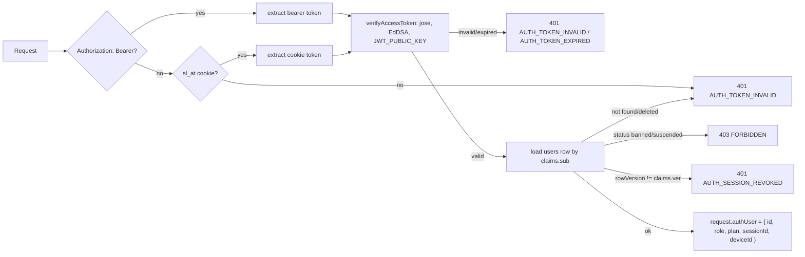
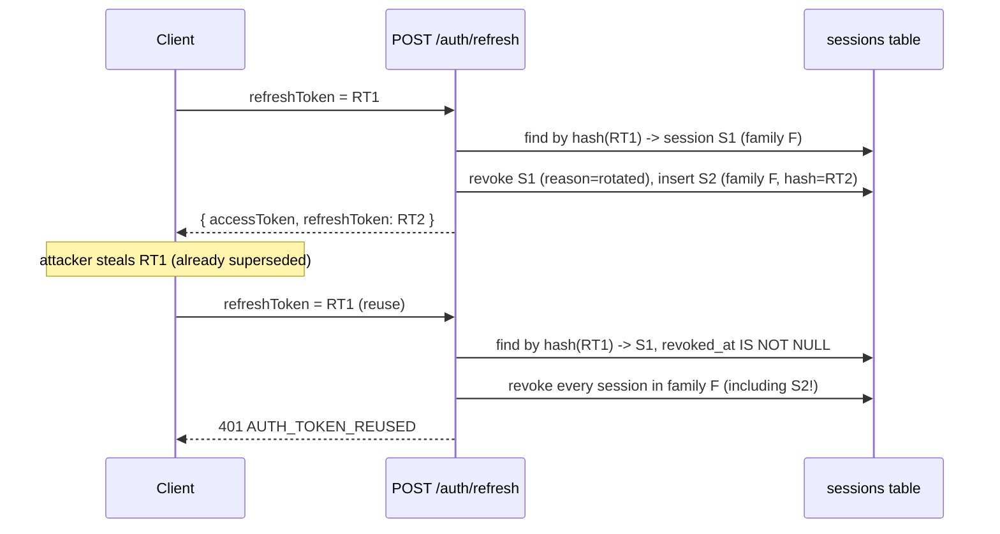
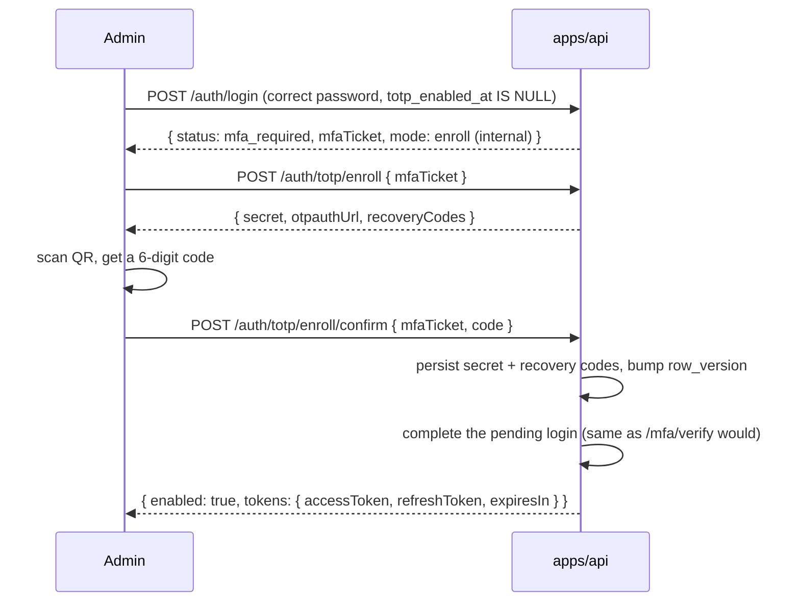

# 04 — Authentication

Status: implementation-ready. Covers `apps/api/src/modules/auth`,
`plugins/{auth,csrf,cookie,rate-limit}.ts`, and `lib/{tokens,crypto,lockout,
devices}.ts`. See [`01-architecture.md` §3.1–3.2](./01-architecture.md) for
the extension-login and bootstrap sequence diagrams — this document covers
everything below that level of detail: token formats/lifetimes, storage
rules, lockout math, the device model, 2FA (including the admin-bootstrap
edge case), the admin permission matrix, and the CSRF model. Route
signatures (bodies/responses/permissions) are in
[`03-api.md`](./03-api.md#auth); this document is *why* they work the way
they do.

## Contents

1. [Two client shapes, one decorator](#1-two-client-shapes-one-decorator)
2. [Access tokens](#2-access-tokens)
3. [Refresh tokens: rotation and reuse detection](#3-refresh-tokens-rotation-and-reuse-detection)
4. [Lockout and rate limiting](#4-lockout-and-rate-limiting)
5. [Device model](#5-device-model)
6. [Two-factor authentication](#6-two-factor-authentication)
7. [Admin roles and permissions](#7-admin-roles-and-permissions)
8. [Force logout](#8-force-logout)
9. [Password reset](#9-password-reset)
10. [CSRF model](#10-csrf-model)
11. [Token/secret storage rules](#11-tokensecret-storage-rules)

---

## 1. Two client shapes, one decorator

The dashboard (browser, cookie session) and the extension (service worker,
bearer token) authenticate completely differently at the transport level,
but both terminate in the exact same `fastify.authenticate` decorator
(`plugins/auth.ts`):

Both token shapes are **literally the same JWT** — a dashboard login sets it
as the `sl_at` httpOnly cookie *and* returns it in the response body (the
body is what the extension reads; the dashboard's fetch wrapper ignores the
body and relies on the cookie). There is no separate "web session" format.
`request.authMethod` (`'bearer' | 'cookie'`) records which path was used,
purely so CSRF enforcement can exempt bearer calls (§10).

`fastify.tryAuthenticate(request)` is the same check but resolves to
`AuthUser | undefined` instead of throwing — used only where a route
legitimately accepts either an authenticated session or an out-of-band
ticket (`POST /auth/totp/enroll`, `POST /auth/logout` with
`allDevices: true`).

## 2. Access tokens

EdDSA (Ed25519) JWT, signed with `JWT_PRIVATE_KEY`, verified with
`JWT_PUBLIC_KEY` (`lib/tokens.ts`). **15 minute** lifetime
(`ACCESS_TOKEN_TTL_SECONDS`). Claims:

| Claim | Meaning |
|---|---|
| `sub` | `users.id`. |
| `sid` | `sessions.id` — the *current* session row (changes on every refresh rotation, §3). |
| `did` | `devices.id`, or `null` (never set for a route that doesn't register a device). |
| `role` | `'user' \| 'admin'`, from `users.role` at issue time. |
| `plan` | The resolved plan code (`EntitlementProvider.getEntitlements().plan`) at issue time, or `null`. Informational only — no route trusts this claim for entitlement decisions; they always re-check the DB via `fastify.entitlements`. |
| `ver` | `users.row_version` at issue time. |
| `iat`/`exp` | Standard JWT, 15 min from issue. |

**Why `ver` matters**: `bump_row_version()` (a Postgres trigger — see
`02-database.md` §1) increments `users.row_version` on *every* `UPDATE` to
that row, not just security-relevant ones. `authenticate` re-checks
`row_version === claims.ver` on every request, so any account-affecting
write — force logout, password change, 2FA enable/disable, an admin
suspending the account, even the benign `lastLoginAt` bookkeeping update
`completeLogin()` does at the end of a successful login — invalidates every
previously-issued access token immediately, without needing a denylist.
This is also why `completeLogin()` deliberately does its `lastLoginAt`
update **before** signing the token it's about to hand back, using the
`row_version` that update itself returns — signing first and updating after
would make a token invalidate itself on arrival (a real bug caught by this
module's own integration tests during development).

## 3. Refresh tokens: rotation and reuse detection

Opaque, never a JWT: 32 random bytes (`lib/crypto.ts randomToken(32)`),
base64url-encoded. Only its SHA-256 hash (`fastHash`, not argon2 — see the
comment in `lib/crypto.ts` on why a fast hash is correct here: the token is
already high-entropy random data, so there's no brute-force benefit to a
slow hash, and a fast hash lets `sessions.refresh_token_hash` be looked up
via a plain unique index instead of scanning). **30 day** lifetime
(`REFRESH_TOKEN_TTL_MS`).

**Rotation is insert-a-new-row, not update-in-place.** Every
`POST /auth/refresh` call:

1. Looks up the session by the presented token's hash.
2. If found and `revoked_at IS NOT NULL` → **reuse detected**: the entire
   `family_id` is revoked (every session sharing it), and the caller gets
   `401 AUTH_TOKEN_REUSED`.
3. If found, not revoked, and expired → `401 AUTH_TOKEN_EXPIRED`.
4. Otherwise: the *old* session row is marked `revoked_at`/`revoked_reason =
   'rotated'`, and a **new** session row is inserted (new id, new
   `refresh_token_hash`, same `family_id`/`user_id`/`device_id`). A fresh
   access token is signed with the new session's id as `sid`.

This is why rotation **must not** overwrite the hash on the same row: doing
so (an earlier version of this code did, and it was caught by this module's
own reuse-detection test) makes a reused token match *no* row at all after
rotation — indistinguishable from "never existed" — instead of "found, but
already revoked", which is what actually triggers the family-wide
revocation. The insert-new-row approach is what makes reuse detectable at
all.

## 4. Lockout and rate limiting

Two independent layers (`lib/lockout.ts`), deliberately not the same
threshold:

1. **Per-account lockout** (`users.failed_login_count`/`locked_until`) — the
   primary defence. 5 consecutive failed password attempts locks the
   account for 15 minutes; each subsequent failure while already
   locked-adjacent doubles the backoff (15m → 30m → 60m → ... capped at
   24h). A successful login resets the counter. Checked **before** the
   password is even verified (`assertNotLocked`), so a locked account
   doesn't leak timing information about whether the presented password
   would have been correct.
2. **Redis sliding-window rate limits**, per-IP and per-account
   (`checkSlidingWindowRateLimit` — a Redis sorted set, members scored by
   timestamp, trimmed and counted on every check). Default 20 requests per
   15 minutes for each of `login`/`register`/`mfa/verify`/
   `resend-verification`/`password/reset-request`. Deliberately set
   *above* the 5-failure lockout threshold: this layer's job is catching
   one IP hammering the route at all (potentially across many different
   accounts, which per-account lockout can't see), not being the primary
   per-account brute-force defence — if it were tighter than 5, a
   legitimate user's own lockout scenario (5 wrong passwords in a row) would
   trip `RATE_LIMITED` before ever reaching the more informative
   `AUTH_ACCOUNT_LOCKED`.
3. A third, coarser layer — `@fastify/rate-limit`'s own per-route
   `config.rateLimit` (same default numbers, IP-keyed, Redis-store) — sits
   in front of both, at the HTTP-plugin level, before a request even reaches
   the route handler.

All three share the same `RATE_LIMITED` (429) error shape when tripped;
`details.retryAfterSeconds` tells the client how long to back off.

## 5. Device model

`devices` rows are unique per `(user_id, fingerprint_hash)` among
non-deleted rows. `fingerprint_hash` is computed **client-side** (the
extension never sends anything more identifying than an opaque hash — no
hardware serials, no EA account data) and treated as an opaque value
server-side; the API never re-derives or validates its construction, only
its uniqueness scope.

`lib/devices.ts findOrRegisterDevice()` is the single seam every login,
`/auth/device/register`, and `/extension/{bootstrap,heartbeat}` call goes
through:

- **Existing, active device, same fingerprint** → reused in place (metadata
  refreshed: `last_seen_at`, `last_ip`, `name`/`browser`/`os`/
  `extension_version` if the caller sent updated values). Never counts
  against the device limit again — logging back in from a device you're
  already on is free.
- **New fingerprint, or an existing-but-revoked one** → the plan's device
  limit (`EntitlementProvider.getEntitlements().deviceLimit`, defaulting to
  the `trial` limit — 1 — for a user with no subscription at all) is
  checked against the count of currently-*active* devices. Under the limit:
  a new row is inserted (or the revoked row is reactivated). At the limit:
  `409 DEVICE_LIMIT_REACHED`, with `details.devices` listing every active
  device (`id`, `name`, `browser`, `os`, `lastSeenAt`) so the client can
  offer "revoke one of these and try again" without a second round trip.

Revoking a device (`DELETE /devices/:id`) also revokes every `sessions` row
bound to it (`device_id` foreign key), so a stolen/lost device is fully cut
off — not just prevented from registering as new, but logged out of
whatever session it already had.

## 6. Two-factor authentication

TOTP (RFC 6238, `otplib`, 30s step, ±1 step window for clock drift), 10
recovery codes (argon2-hashed, single-use, `XXXX-XXXX` format). The secret
is encrypted at rest with AES-256-GCM (`lib/crypto.ts
encryptTotpSecret`/`decryptTotpSecret`) under a key derived from
`COOKIE_SECRET` via SHA-256 with a purpose-specific salt string — a
deliberate choice over adding a second required secret env var, while still
never reusing `COOKIE_SECRET`'s raw bytes for a different purpose than its
name implies.

**Enrollment is two calls**, because a client always needs to *show* the
secret/QR before the user can prove they've saved it:

1. `POST /auth/totp/enroll` — generates a secret + 10 recovery codes,
   stashes them in Redis (10 min TTL, keyed by user id — *not yet
   persisted*), returns them to the client (once — the API never returns a
   plaintext secret or recovery code again after this call).
2. `POST /auth/totp/enroll/confirm` — the user types back a current 6-digit
   code; if it validates against the pending secret, the secret is
   encrypted and persisted, the recovery codes are argon2-hashed and
   persisted, and `row_version` is bumped (§2 — this invalidates the
   enrolling session's own now-stale-claims access token, same as any other
   account-affecting write).

**Step-up at login** (`POST /auth/mfa/verify`): `/auth/login` returns
`{status: 'mfa_required', mfaTicket}` instead of tokens whenever the account
has TOTP enabled. The ticket (5 min TTL, Redis, `mode: 'verify'`) carries
the pending login context (`userId`, `device`, `ip`, `userAgent`) so
`/mfa/verify` can complete exactly the same `completeLogin()` path a
non-2FA login would have taken, once the code checks out. A wrong code
increments a per-ticket attempt counter (max 8) without consuming the
ticket, so a mistyped code doesn't force a fresh login; the ticket is
deleted (single-use) only on success or after 8 failed attempts.

**Admin accounts must have 2FA enabled to log in at all** (project
instruction / PHASE 4). This creates a bootstrap problem: a brand-new admin
(from `seed.ts`, or granted `admin_role` by another admin) has no TOTP
secret yet, so how do they ever log in to enroll one? The login flow
resolves this with a **second ticket mode**: if `role === 'admin'` and
`totp_enabled_at IS NULL`, `/auth/login` returns the same
`{status:'mfa_required', mfaTicket}` shape, but the ticket's `mode` is
`'enroll'` instead of `'verify'`. `POST /auth/totp/enroll` and
`/auth/totp/enroll/confirm` both accept this ticket in place of an
authenticated session (`resolveEnrollmentSubject` in
`modules/auth/service.ts`); `confirm`, on the ticket path, both persists the
new 2FA secret **and** completes the pending login in the same response
(`{enabled: true, tokens: {...}}`) — so enrolling *is* logging in, for that
one first time.

Disabling 2FA (`POST /auth/totp/disable`) requires both the current
password **and** a current code (TOTP or a recovery code) — never just one
factor to remove the other factor.

## 7. Admin roles and permissions

`@sl/shared`'s `PERMISSION_MATRIX` (`packages/shared/src/permissions.ts`) is
the single source of truth; `fastify.requirePermission(permission)`
(`plugins/auth.ts`) is the only enforcement point — it requires
`role === 'admin'` (via `requireAdmin`, which itself requires
`authenticate`) plus the caller's `admin_users.admin_role` granting that
permission.

| Role | Gets |
|---|---|
| `super_admin` | Every permission. |
| `support` | `users.read`, `users.write`, `users.suspend`, `users.force_logout`, `users.reset_password`, `subscriptions.read`, `audit.read`. Never money (`subscriptions.write`, `coupons.write`, `plans.write`) or config/system/analytics. |
| `analyst` | `users.read`, `subscriptions.read`, `audit.read`, `analytics.read`, `system.read`. Read-only everywhere, including audit — safe for reporting with zero write risk. |
| `billing` | `users.read`, `subscriptions.read`, `subscriptions.write`, `coupons.write`, `plans.write`, `audit.read`. The money-shaped surface, plus enough user read access to look up an account — but never `users.suspend`/`.ban`/`.force_logout`. |

Since admin login always requires 2FA (§6), there is no separate mid-session
step-up for admin actions — an admin's access token already attests to a
2FA-verified login. `requirePermission` does not re-check TOTP per request.

## 8. Force logout

`POST /admin/users/:id/force-logout` (`users.force_logout` permission):
revokes every active session for the target user
(`repo.revokeAllUserSessions`), bumps `row_version`
(`repo.bumpUserVersion` — invalidates every outstanding access token
immediately, §2), publishes `session.revoked` over WebSocket for each
revoked session (`publishToUser` → the user's own `ws:user:{id}` channel —
see [`03-api.md` §`ws`](./03-api.md#ws)), and emails the user a notice
(`emails/templates.ts forceLogoutNoticeHtml/Text`). All of this happens
before the audit row is written, so a failure partway through (e.g. the
email provider being down) never leaves an audit row asserting something
that didn't fully happen — the mail send itself is wrapped in `.catch()` and
logged rather than failing the whole request, since "the account is safe
now" (sessions revoked) matters more than "the user was emailed about it".

## 9. Password reset

`POST /auth/password/reset-request` always returns `200 {sent: true}`
regardless of whether the email exists — this endpoint (and
`/auth/resend-verification`) are the two places in this module that
deliberately never reveal account existence via response shape. The token
is `fastHash`'d the same way a refresh token is (high-entropy random data,
no benefit from a slow hash), 1 hour TTL, single use
(`password_resets.consumed_at`). `POST /auth/password/reset-confirm`
succeeding revokes every session for that user and bumps `row_version` —
resetting your password logs out every device, including whatever device
the reset itself is happening from (the client must log in fresh
afterwards).

## 10. CSRF model

Double-submit cookie (`@fastify/csrf-protection`, `plugins/csrf.ts`): the
`sl_csrf` cookie (signed, **not** httpOnly — the dashboard's JS reads it to
set the `x-csrf-token` header) must match the header on every
cookie-session mutation. `fastify.verifyCsrf` is a
`(request, reply, done)`-style preHandler — deliberately kept in that
callback shape (matching the underlying `fastify.csrfProtection`'s own
signature) rather than wrapped in a promise, because the underlying check
calls `reply.send(error)` directly on failure without calling `done()`, and
Fastify's hook system only short-circuits correctly for a callback-style
hook when it recognizes that arity; a promise-wrapping version would hang
waiting for a `done()` that never comes.

**Bearer-authenticated requests (`request.headers.authorization` present)
skip the check entirely** — `verifyCsrf`'s first line is exactly that
condition. This is safe, not a hole: CSRF is fundamentally about a
cross-site page making the *browser* attach ambient credentials (cookies)
to a request the page didn't construct the headers for; a custom
`Authorization` header can only be set by JavaScript that already has the
bearer token in hand (same-origin, or the extension's own privileged
context), which a CSRF attack by definition does not have.

Routes that mutate state under a cookie session add
`preHandler: [fastify.verifyCsrf]` alongside `onRequest: [fastify.authenticate]`
— see the "CSRF (cookie only)" notes in [`03-api.md`](./03-api.md).

## 11. Token/secret storage rules

| What | Where (API side) | Where (client side, per `01-architecture.md`) |
|---|---|---|
| Access token | Never stored — 15 min, re-issued on refresh/login. | Dashboard: `sl_at` httpOnly cookie. Extension: `storage.session` (cleared on browser restart). |
| Refresh token | `sessions.refresh_token_hash` (SHA-256, not the plaintext). | Dashboard: `sl_rt` httpOnly cookie, `path=/api/v1/auth` (never sent to non-auth routes). Extension: encrypted in `storage.local`. |
| Password | `users.password_hash` (argon2id). | Never stored client-side beyond the in-flight request. |
| TOTP secret | `users.totp_secret_enc` (AES-256-GCM, §6). | Never stored client-side after enrollment's one-time display. |
| Recovery codes | `totp_recovery_codes.code_hash` (argon2, one row per code). | Never stored client-side after enrollment's one-time display (the user is expected to save them out-of-band). |
| Email verification / password reset tokens | `*.token_hash` (SHA-256 — high-entropy random data already, §9). | Only ever exist as a URL query param in a one-time email link. |
| Entitlement blob | Not stored server-side (stateless, signed on demand). | Extension: `storage.local`, used only during the 24h offline-grace window; verified locally, never re-parsed for anything beyond "was this issued and is it still within its own expiry". |
