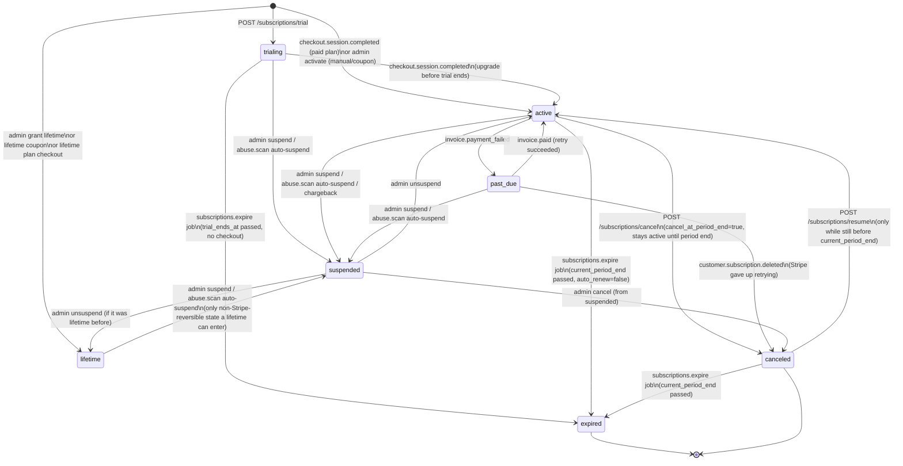

# 05 — Subscriptions & Payments

Status: implementation-ready for the modules it covers
(`apps/api/src/modules/{subscriptions,licenses,payments,coupons,plans,bans,flags}`
and their `admin-*` counterparts). Owned by the subscriptions & payments
agent (`docs/01-architecture.md` PHASE 5 / wave 2). Builds directly on the
schema in [`02-database.md`](./02-database.md) (`plans`, `subscriptions`,
`licenses`, `devices`, `payments`, `payment_history`,
`stripe_webhook_events`, `coupons`, `coupon_redemptions`, `bans`, `flags`,
`ip_activity`) and the pure logic in `@sl/shared`
(`src/license-key.ts`, `src/email-normalise.ts`,
`src/constants/plans.ts`, `src/schemas/subscriptions.ts`).

## Contents

1. [Plan matrix](#1-plan-matrix)
2. [Subscription state machine](#2-subscription-state-machine)
3. [License key format + checksum algorithm](#3-license-key-format--checksum-algorithm)
4. [Entitlement blob format](#4-entitlement-blob-format)
5. [Trial protection](#5-trial-protection)
6. [Abuse heuristics](#6-abuse-heuristics)
7. [Stripe webhook handling](#7-stripe-webhook-handling)
8. [Admin operations + audit fields](#8-admin-operations--audit-fields)
9. [Jobs](#9-jobs)
10. [Route summary](#10-route-summary)

---

## 1. Plan matrix

Plans are **data** (`plans` table) so an admin can create a new plan
(including a one-off lifetime plan) without a deploy, but the five seeded
plan codes below are the ones the rest of the system has fixed device-limit
and feature behaviour for (`@sl/shared`'s `PLAN_CODES`, `DEVICE_LIMITS`,
`PLAN_FEATURES` — the single source of truth every module imports instead of
re-declaring these numbers).

| Plan       | Price          | Interval   | Device limit | `is_lifetime` | Feature keys (additive)                                                                                                                    |
| ---------- | -------------- | ---------- | ------------- | -------------- | --------------------------------------------------------------------------------------------------------------------------------------------- |
| `trial`    | 0¢             | 7 days¹    | 1             | false          | `ledger.recorder`, `ledger.price_model`, `assist.ranker`, `assist.filter_rotation`, `assist.session_pnl`, `assist.risk_meter`                  |
| `basic`    | 499¢/mo        | month      | 1             | false          | `ledger.recorder`, `ledger.price_model`                                                                                                        |
| `pro`      | 999¢/mo        | month      | 2             | false          | `basic` + `assist.ranker`, `assist.filter_rotation`, `assist.session_pnl`, `assist.risk_meter`, `dashboard.analytics`                          |
| `ultimate` | 1999¢/mo       | month      | 3             | false          | `pro` + `automation.autobuyer`, `dashboard.multi_device`, `support.priority`                                                                    |
| `lifetime` | 9999¢ one-time | `one_time` | 3             | true           | same as `ultimate`                                                                                                                              |

¹ `trial` is priced at 0¢/mo in `plans` (so it fits the same billing shape as
every other plan for the plans list/admin UI) but is never billed — its
_actual_ duration is `TRIAL_LENGTH_DAYS` (7) from `@sl/shared`, applied to
`subscriptions.trial_ends_at` when a trial subscription is created (§2, §5).

**Admin-created plans** (`admin-plans` module): any additional plan is valid
as long as it satisfies the DB constraints in `02-database.md` §6.3
(`price_cents >= 0`, `device_limit BETWEEN 1 AND 10`, a lifetime plan must
have `interval = 'one_time'` and vice versa). A plan not in `PLAN_CODES` is
fully supported by the plans/subscriptions/licenses modules — they read
`device_limit`/`features`/`is_lifetime` from the `plans` row, never from the
`@sl/shared` constants, at every point that matters for entitlement
(`@sl/shared`'s plan constants are the fixed-plan fast path for the
extension/dashboard UI and the seed; the database row is always the runtime
source of truth). `GET /plans` returns only `is_active = true`, non-deleted
plans, ordered by `sort_order`.

---

## 2. Subscription state machine



Notes:

- **One live subscription per user**, enforced by
  `subscriptions_one_live_per_user` (`02-database.md` §6.3): "live" =
  `status IN (trialing, active, past_due, suspended, lifetime)`. Every module
  that creates a subscription (`POST /subscriptions/trial`, checkout webhook,
  admin activate/grant-lifetime) first checks for an existing live row and
  returns `CONFLICT` rather than relying solely on the DB constraint to
  reject a bad request late.
- **`canceled` is soft** — `cancel_at_period_end = true` is set immediately
  by `POST /subscriptions/cancel`, but `status` stays `active` (or
  `past_due`) until the `subscriptions.expire` job (§9) flips it to
  `canceled` at `current_period_end`, OR the Stripe webhook
  `customer.subscription.deleted` arrives first (whichever happens first —
  the webhook path is authoritative when both could apply, since it reflects
  what actually happened on Stripe's side).
- **`suspended`** is the only state abuse handling and admin moderation can
  reach from *any* other live state, and is deliberately not reachable by
  any Stripe webhook directly — a chargeback (§7) suspends via the same
  application-layer path admin suspend uses, not a bespoke state transition,
  so "why is this account suspended" always has one code path
  (`subscriptions/service.ts#suspend`) to read.
- **`expired`** and **`canceled`** are terminal for that subscription row; a
  user who wants back in starts a **new** subscription (new checkout, new
  admin grant, etc.) rather than resurrecting the old row — this keeps
  `subscriptions` a true history and matches `02-database.md`'s "historical
  (canceled/expired) subscriptions" language for the partial-unique-index
  rationale.
- **`lifetime`** subscriptions have `current_period_end = NULL`,
  `auto_renew = false`, and are never touched by `subscriptions.expire`
  (its query is scoped to `current_period_end IS NOT NULL AND
  current_period_end < now()`, which a lifetime row never matches). The DB
  constraint requires `source IN (manual, coupon)` for `status = lifetime` —
  a lifetime plan bought via Stripe Checkout is recorded with
  `source = 'stripe'` and `status = 'active'`, `current_period_end = NULL`,
  `auto_renew = false` instead (§7, `checkout.session.completed` for an
  `is_lifetime` plan); only an **admin grant** or a **lifetime coupon**
  produces `status = lifetime` literally, per the DB constraint.

---

## 3. License key format + checksum algorithm

Implemented in `@sl/shared`'s `src/license-key.ts`
(`generateLicenseKey`/`normaliseLicenseKey`/`validateLicenseKeyFormat`/
`computeChecksum`), imported by `apps/api/src/modules/licenses`. Full
rationale lives as doc comments in that file; summarised here for the
webhook/admin/extension flows that depend on it.

**Shape:** `SL-XXXX-XXXX-XXXX-XXXX` — literal `SL-` prefix, then 16
Crockford base32 characters (alphabet `0123456789ABCDEFGHJKMNPQRSTVWXYZ` —
32 symbols, `I`/`L`/`O`/`U` excluded to avoid visual confusion and a common
profanity substring) split into four 4-character blocks.

- **First 14 characters = payload.** Pure randomness (70 bits from 9
  cryptographically random bytes, generated in `apps/api` via
  `crypto.randomBytes(9)` and passed into `generateLicenseKey`, which never
  imports `node:crypto` itself so it stays platform-agnostic). The payload
  carries **no embedded structure** (no user id, no plan code) — the key is
  opaque, and everything it grants is looked up server-side by
  `key_hash` (§8, `02-database.md` §6.3). This is a deliberate anti-guessing
  property: two keys for the same user's two licenses look nothing alike.
- **Last 2 characters = checksum.** A position-weighted sum of the 14
  payload characters' numeric values (weights 1..14, `sum mod 1024`, encoded
  as 2 more base32 characters). Catches essentially all single-character
  typos and the large majority of adjacent-character transpositions before a
  request ever reaches the database — **not** a cryptographic MAC; a
  correctly-checksummed key that was never issued is still rejected, just
  one query later (`key_hash` miss → `LICENSE_INVALID`).

**Storage:** only `key_hash` (SHA-256 of the full canonical key string) and
`key_prefix` (the first block, e.g. `SL-9F2K`, safe to show in support UI)
are ever persisted (`licenses.key_hash`, `licenses.key_prefix`). The full key
is returned to the caller **exactly once**, in the response body of whichever
action issued it (subscription activation, `POST /licenses/regenerate`), and
never logged, never re-derivable, never re-displayed by `GET /licenses/me`.

**Normalisation** (`normaliseLicenseKey`) is applied to every user-supplied
key before lookup (`POST /licenses/validate`, admin support search by
prefix): trims whitespace, upper-cases, strips a leading `SL`/`SL-` and all
internal dashes/whitespace, remaps Crockford's canonical look-alikes
(`O`→`0`, `I`/`L`→`1`; `U` is never remapped — an input containing `U` is
rejected outright, matching Crockford's own spec), then re-inserts dashes.
`validateLicenseKeyFormat` layers the checksum check on top and returns one
of `{ valid: true }`, `{ valid: false, reason: 'MALFORMED' }` (garbage
input — never reached the DB), or `{ valid: false, reason:
'CHECKSUM_MISMATCH' }` (well-formed but corrupted — logged distinctly from a
DB miss so "user mistyped their key" and "user is guessing keys" are
distinguishable in the extension's error UX and in abuse telemetry).

**Issuance:** exactly one active license per subscription, created by
`apps/api/src/modules/licenses/service.ts#issueForSubscription` whenever a
subscription transitions into a state that should carry a license
(`trialing`, `active`, `lifetime` — never `past_due`/`canceled`/`suspended`/
`expired`, which instead revoke or let the existing license lapse, §9).
`max_devices` is copied from `plans.device_limit` **at issuance time** (not
looked up live), so a later plan edit doesn't retroactively change an
already-issued license's device ceiling — an explicit device-limit override
per license (Admin operations, §8) is the supported way to change one
license's ceiling after the fact.

---

## 4. Entitlement blob format

The signed blob cached by the extension for the 24h offline grace
(`01-architecture.md` §3.2) and returned by `POST /licenses/validate`,
`POST /extension/bootstrap` and `POST /extension/heartbeat` (the latter two
owned by the core agent's `EntitlementProvider`, §"Cross-agent touchpoints"
below — this module's `licenses` service reuses the same signer rather than
defining a second one).

**As actually implemented** (`apps/api/src/lib/entitlements.ts`'s
`EntitlementSnapshot`, mirrored by `@sl/shared`'s
`entitlementSnapshotSchema` — this superseded an earlier draft of this
section written before that file existed; the shape below is the real one):

```jsonc
{
  "plan": "ultimate",                 // plan code, or null if the user has never had a subscription
  "planName": "Ultimate",             // plans.name, or null
  "status": "active",                 // subscriptions.status, or null
  "features": [                       // PLAN_FEATURES[plan] when status is trialing/active/lifetime, else []
    "ledger.recorder",
    "assist.ranker",
    "automation.autobuyer"
  ],
  "deviceLimit": 3,                   // plans.device_limit, or DEVICE_LIMITS.trial as a floor when there is no subscription yet
  "expiresAt": "2026-10-20T00:00:00Z",      // same value as currentPeriodEnd (kept as a separate field for the extension's own clarity)
  "currentPeriodEnd": "2026-10-20T00:00:00Z", // subscriptions.current_period_end, null for a trial in progress or a lifetime grant
  "license": {                        // the subscription's active license, or null if none has been issued yet
    "keyPrefix": "SL-9F2K",
    "status": "active",
    "maxDevices": 3,
    "expiresAt": null
  }
}
```

This is signed as the JWS's `snapshot` claim (`new SignJWT({ snapshot,
deviceId }).setSubject(userId).setIssuedAt()...`) — `userId` and `issuedAt`
live in the JWT's own `sub`/`iat` claims rather than being duplicated inside
`snapshot`, which is what the extension's `jose` verification step reads for
the offline-grace `issuedAt`/`userId` check instead of parsing them out of
this JSON body.

**Signing:** Ed25519 (EdDSA), compact JWS via `jose`, key material from
`ENTITLEMENT_SIGNING_KEY` (env, PKCS8 PEM private key; the public key —
`ENTITLEMENT_PUBLIC_KEY` — is embedded in the extension build for local
verification during the offline grace window). This is the **same** signer
the core agent's default `EntitlementProvider` implementation
(`apps/api/src/lib/entitlements.ts`, decorated onto `fastify.entitlements` by
`plugins/entitlements.ts`) uses — this module calls
`fastify.entitlements.getEntitlements(userId)` /
`.signEntitlementBlob(snapshot, userId, deviceId)` from `POST
/licenses/validate` rather than standing up a second Ed25519 keypair or a
second `jose` call site. Per the core agent's own note in
`plugins/entitlements.ts`, Fastify does not allow redecorating `entitlements`
within the same encapsulation context, so this module never attempts to
replace the decoration — it only ever consumes the `EntitlementProvider`
interface the core agent published.

**Verification (extension side, documented for completeness — implemented in
`apps/extension`):** the cached blob's signature is checked against the
embedded public key; if valid and `issuedAt` is within
`offline_grace_hours` (`system_config`, default 24) of the extension's local
clock, the cached entitlement is trusted without a network round trip.
Outside that window, or on signature failure, the extension downgrades to M1
read-only until a fresh bootstrap/heartbeat succeeds.

---

## 5. Trial protection

`POST /subscriptions/trial` denies a trial (`403 TRIAL_ABUSE_DETECTED`) and
writes a `flags` row (`kind = 'trial_abuse'`, `severity` per table below,
`evidence` = the exact match(es) that triggered the denial) whenever **any**
of these four checks matches an existing trial within the lookback window.
All four run on every trial request, not short-circuited at the first
match, so `evidence` can record every reason at once (useful for the
abuse-review queue — a request that trips several heuristics at once is a
stronger signal than one that trips one).

| # | Check | Key | Window | Data source |
|---|---|---|---|---|
| 1 | **Email** | `normaliseEmailForAbuseCheck(email)` (`@sl/shared` — gmail dot/plus stripping + domain lowercasing) | unbounded (no lookback — a normalised email that has ever had a trial never gets a second one) | An indexed equality lookup against `users.email_normalised` (migrations/0025), a `GENERATED ALWAYS AS STORED` column Postgres computes and keeps in sync automatically from `email` via an IMMUTABLE SQL function (`normalise_email_for_abuse_check`) mirroring `normaliseEmailForAbuseCheck()` byte-for-byte — replacing the original scan-and-normalise-in-application-code approach (see the former "scaling note" this superseded). Joined to every subscription whose `trial_ends_at IS NOT NULL`. |
| 2 | **Device fingerprint** | SHA-256 hash of the *authenticated request's own device* fingerprint — `request.authUser.deviceId` (set by login/registration, not resubmitted by the trial call) looked up in `devices` for its `fingerprint_hash` | 30 days | Every other `devices` row (any user) sharing that `fingerprint_hash`, joined to that user's trial-having subscriptions, `devices.first_seen_at` within 30 days |
| 3 | **IP /24** | The request IP's `/24` (first three octets for IPv4; `/48` for IPv6, same rationale — coarse enough to catch "same household/NAT/VPN exit" without flagging an entire ISP) | 30 days | `ip_activity` (rows written by this module on every trial attempt, successful or not — `recordTrialIpActivity()`), joined to trial-having subscriptions |
| 4 | **Stripe customer** | The requester's own `users.stripe_customer_id` (migrations/0025) — `null` for most trial requests, since a trial by definition never itself goes through Stripe Checkout; this check only runs when the requesting account already has one, e.g. from an earlier, now-non-live paid subscription or an earlier Customer Portal call on this same account | unbounded (same rationale as check 1: two accounts resolving to the same live Stripe customer is never legitimate) | Every user sharing that exact `stripe_customer_id`, joined to that user's trial-having subscriptions — same false-positive guard as checks 2/3 below (only counts a *prior trial*, never a prior paid subscription) |

**Severity mapping** (written to `flags.severity`): 1 match → `low`; 2
matches → `medium`; 3 or more → `critical` (skipping `high` — several
independent signals agreeing is treated as certain, not merely likely).
`abuse.scan` (§6) does not re-flag these — trial-time denial is synchronous
and immediate, `abuse.scan` covers patterns that only emerge after the fact
(velocity, cross-account fingerprint reuse, chargebacks).

**False-positive guard:** checks 2, 3 and 4 only count a *prior trial*,
never a prior *paid* subscription — a shared office IP/device (or, for
check 4, two accounts that happen to resolve to the same Stripe customer
through an unrelated support flow) where one person is on `pro` and another
starts a trial is not flagged by IP/device/Stripe-customer alone (only by
check 1, email, which is a much stronger signal on its own). This is the
"true positive vs. false-positive-avoidance" pairing the roadmap's Phase 5
exit criteria calls for, and is covered by
`apps/api/src/modules/subscriptions/__tests__/subscriptions.test.ts`.

**Feature-toggle gate:** `trial.enabled` (`feature_toggles`, seeded `true`)
is checked before any of the four heuristics — when off, every trial
request returns `403 SUBSCRIPTION_REQUIRED` regardless of history (a kill
switch for the trial funnel entirely, independent of abuse detection).

---

## 6. Abuse heuristics

`abuse.scan` (hourly job, §9) runs four detectors, each writing a `flags`
row (`kind` as listed) and auto-suspending the affected subscription(s) when
`evidence.score` crosses `system_config`'s
`abuse.auto_suspend_severity_threshold` (seeded `high` — i.e. `high` and
`critical` auto-suspend, `low`/`medium` land in the review queue only).
Every write is `actor_type = 'system'` in `audit_logs` (§8).

| Detector | `flags.kind` | Threshold (from `system_config`, overridable by admin) | What it queries |
|---|---|---|---|
| **Device-registration velocity** | `velocity` | `abuse.max_devices_per_ip_per_day` (seeded 5) — more than N distinct `devices` rows first-seen from the same IP in a rolling 24h window | `devices` joined to `ip_activity` |
| **License shared across many networks** | `multi_account`¹ | `abuse.max_asns_per_license_24h` (seeded 3) — one `licenses` row validated (`POST /licenses/validate`, §3) from more than N distinct ASNs in 24h | `licenses.last_validated_at` history (validation attempts logged to `user_activity` by the core auth/activity module; this module reads that table, never writes to it) joined to `ip_activity.asn` |
| **Chargebacks** | `chargeback` | Any `charge.dispute.created` webhook (§7) — zero-tolerance, always `severity = 'critical'`, always auto-suspends regardless of the general threshold | `stripe_webhook_events` / `payment_history` |
| **Multi-account by fingerprint** | `multi_account`¹ | `abuse.max_accounts_per_fingerprint` (seeded 3) — more than N distinct `user_id`s ever registered a `devices` row with the same `fingerprint_hash` | `devices` grouped by `fingerprint_hash` |

¹ Device-velocity-by-fingerprint and license-sharing-by-ASN both write
`kind = 'multi_account'`; `evidence.detector` (a string field inside the
JSONB, e.g. `"multi_account.fingerprint"` vs. `"multi_account.asn"`)
disambiguates them for the admin review UI without needing a fifth enum
value — `flag_kind` stays exactly the five values `02-database.md` §6.8
documents.

`evidence` JSONB shape (consistent across detectors so the admin-flags list
can render one generic table): `{ detector, score, threshold, matchedIds:
string[], windowStart, windowEnd, sample: Record<string, unknown> }`.

**Auto-suspend path:** identical code path to admin suspend
(`subscriptions/service.ts#suspend`), called with `actor = { type: 'system'
}` instead of an admin user — so `subscriptions.expire`'s and
`abuse.scan`'s suspensions produce the exact same shape of `audit_logs` row
as a human admin's, just with `actor_type = 'system'` and `actor_id = null`
(`02-database.md` §6.9: "`actor_id`... null only if `actor_type =
system`").

---

## 7. Stripe webhook handling

`POST /webhooks/stripe` — raw body (Fastify content-type parser configured
to preserve it for this route specifically), `stripe.webhooks.constructEvent`
signature verification against `STRIPE_WEBHOOK_SECRET`, then an
**idempotency check** against `stripe_webhook_events.event_id` (unique
index) before any side effect: the event row is inserted first
(`processed_at = null`), and if the insert hits the unique constraint, the
handler returns `200` immediately without reprocessing (a re-delivered
Stripe event — Stripe retries on anything but a 2xx — is a guaranteed no-op,
verified by `webhook idempotent double delivery` test, §deliverable 8 in the
task brief). On successful processing `processed_at` is stamped; on a
handler error `error` is set and the row is left with `processed_at = null`
so `stripe.reconcile` (§9) can find and retry it.

| Stripe event | Handler action |
|---|---|
| `checkout.session.completed` | Look up the `plans` row by `stripe_price_id` from the session's line item. Idempotent guard: skip entirely if the user already has a live **non-trial** subscription (a duplicate/late delivery); a live **trial** is not treated as a conflict — it is the row this event upgrades (see "Atomic trial→paid" below). **Atomic trial→paid** (`apps/api/src/modules/payments/webhooks.ts#handleCheckoutCompleted`): when the user has a live `trialing` row, ending it (`status → canceled`, `ended_at = now()`, `trial_ends_at = NULL` — the CHECK constraint requires the latter) and revoking its license, creating the new `subscriptions` row (`status = active`, or `lifetime`'s special case below), issuing its license, redeeming any attached coupon, and recording the `payments` row all happen inside **one database transaction**, so a crash partway through can never leave a user with two live subscriptions, an un-ended trial, or a paid row with no license. **Lifetime plan exception:** if `plans.is_lifetime`, set `current_period_end = NULL`, `auto_renew = false`, `status = 'active'` (not `'lifetime'` — the DB constraint reserves that status for `source IN (manual, coupon)`, §2). If `session.customer` is present, persist it onto `users.stripe_customer_id` (migrations/0025, inside the same transaction) — this is what the Customer Portal lookup and the trial-abuse check 4 (§5) both read. If `couponCode` was attached to the session's metadata, record the `coupon_redemptions` row and increment `coupons.redeemed_count`. Publish `subscription.changed` (§below) and a `notifications` row ("Welcome to <plan>") after the transaction commits. |
| `invoice.paid` | Renewal. Update the matching `subscriptions` row's `current_period_start/end` from the invoice's period, and `status`: `past_due → active` if it was in dunning, otherwise stays `active`. Insert `payments` (`succeeded`) + `payment_history`. If the subscription's license is `expired`/`revoked` from a prior lapse, re-issue (only case where a *second* license is legitimately issued for one subscription — the old one stays `revoked`, never reactivated, so a leaked old key can't come back to life). Publish `subscription.changed`. |
| `invoice.payment_failed` | `status → past_due`. Insert `payments` (`failed`) + `payment_history`. Publish `subscription.changed` and a `notifications` row prompting the user to update their card (portal link, §10). Does **not** touch the license — a `past_due` subscription keeps its existing license valid until either `invoice.paid` recovers it or `subscriptions.expire`/`customer.subscription.deleted` ends it, matching Stripe's own dunning grace period. |
| `customer.subscription.updated` | Generic sync for anything not covered by a more specific event above (e.g. a plan change made directly in the Stripe dashboard, proration adjustments): re-read the Stripe subscription object, map its `status`/`current_period_end`/`cancel_at_period_end` onto the local row via the same field mapping `stripe.reconcile` (§9) uses, so this handler and the nightly job share one `syncFromStripeSubscription()` function rather than two drifting implementations. |
| `customer.subscription.deleted` | `status → canceled`, `ended_at = now()`. Revoke the license (`revoked_reason = 'subscription_ended'`). Publish `subscription.changed`. |
| `charge.refunded` | Insert `payment_history` (`event = 'refunded'`, `raw_event` = the charge object). Does not by itself change subscription status (a partial refund/goodwill gesture is not necessarily a cancellation) — an admin or a subsequent `customer.subscription.deleted` handles the entitlement side if the refund does end the subscription. |
| `charge.dispute.created` (chargeback) | Insert `payment_history` (`event = 'disputed'`). Create a `flags` row (`kind = 'chargeback'`, `severity = 'critical'`, `evidence = { chargeId, amount, reason }`) and **suspend** the subscription immediately via the same `suspend()` path §6 describes (`actor = { type: 'system' }`, reason `"stripe chargeback: <chargeId>"`). This is the one webhook-driven route into `suspended` (§2's note that suspension is otherwise never a direct webhook target) — deliberately: a chargeback is evidence of fraud/payment reversal, not a normal lifecycle event, so it goes through the abuse path rather than the lifecycle path. |

**Source of truth:** the local `subscriptions`/`licenses`/`payments` tables
are authoritative for every entitlement decision the API makes
(`GET /subscriptions/me`, `/extension/bootstrap`, `/licenses/validate`) —
Stripe is never queried synchronously on the entitlement-check path. Webhooks
keep local state fresh in near-real-time; `stripe.reconcile` (§9) is the
correctness backstop for any missed/out-of-order webhook delivery.

---

## 8. Admin operations + audit fields

Every `admin-subscriptions`/`admin-coupons`/`admin-plans`/`admin-bans`/
`admin-flags` mutation:

1. Requires the matching `@sl/shared` permission
   (`subscriptions.write`/`coupons.write`/`plans.write`/`users.suspend`¹) via
   the core agent's `requirePermission` route decorator.
2. Requires a `reason` (`adminActionRequestSchema`, `@sl/shared`'s
   `schemas/admin.ts` — already enforced at the schema level, so there is no
   code path that skips it).
3. Reads the row **before** mutating (`before` snapshot), applies the
   change, reads it **after**, and calls the core agent's `recordAudit()`
   helper with `{ actorType: 'admin', actorId: adminUser.id, action,
   entityType, entityId, before, after, reason }` — `recordAudit` is
   responsible for diffing and the `audit_logs` insert
   (`02-database.md` §6.9); this module never inserts into `audit_logs`
   directly.
4. Also writes an `admin_actions` row (the lighter, admin-screen-optimised
   log, §6.1 of `02-database.md`) with the same `action`/`target_type`/
   `target_id`/`reason` — this module writes `admin_actions` itself
   (unlike `audit_logs`, which goes through the shared helper), since
   `admin_actions` is specifically the admin activity feed this module's
   endpoints are populating.
5. Publishes `subscription.changed` (or the relevant WS event) via the core
   agent's `publishToUser(userId, event)` helper so the affected user's
   dashboard/extension picks up the change without waiting for the next
   poll.

¹ `bans`/`flags` administration uses `users.suspend`/`users.ban` (already in
`PERMISSION_MATRIX`) rather than a new permission — a ban is a user-moderation
action, not a billing one, even though this module owns the endpoint.

| Operation | Endpoint | Effect |
|---|---|---|
| **Activate** (manual grant) | `POST /admin/subscriptions/:userId/activate` | Creates a `subscriptions` row: `source = 'manual'`, `status = active`, `current_period_start = now()`, `current_period_end = now() + periodDays`, `granted_by_admin_id`. Issues a license. Rejected with `CONFLICT` if a live subscription already exists (§2). |
| **Extend** | `POST /admin/subscriptions/:id/extend` | `current_period_end += periodDays` (rejects on a `lifetime`/`current_period_end IS NULL` row — nothing to extend). Does not touch `status`. |
| **Suspend** | `POST /admin/subscriptions/:id/suspend` | `status → suspended`. License stays issued but `POST /licenses/validate` returns `LICENSE_REVOKED`-equivalent denial for a suspended subscription's license (checked by joining to the subscription's status at validate time, not by revoking the license row itself — so unsuspend, below, doesn't need to re-issue a key). |
| **Unsuspend** | `POST /admin/subscriptions/:id/unsuspend` | `status →` whatever it was before suspension (`previous_status` is recorded in `admin_actions.metadata` at suspend time so unsuspend is exact, not a guess — reverts to `active` by default if no prior status was recorded, e.g. a subscription suspended at creation). |
| **Cancel** | `POST /admin/subscriptions/:id/cancel` | Same effect as the user-facing `POST /subscriptions/cancel` (§10) but admin-initiated and immediate-eligible (`immediate: boolean` body field — `true` sets `status → canceled` right away instead of at period end, for refund-driven cancellations). |
| **Grant lifetime** | `POST /admin/subscriptions/:userId/grant-lifetime` | Creates (or converts an existing live subscription into) a `status = 'lifetime'`, `source = 'manual'`, `current_period_end = NULL`, `auto_renew = false` row. Issues a license with `expires_at = NULL`. |
| **Set device limit override** | `POST /admin/licenses/:id/device-limit` | Updates `licenses.max_devices` directly (bypasses the plan's `device_limit` for this one license only — the plan/subscription are untouched). |
| **Create/update/archive plan** | `admin-plans` CRUD | Archive = `is_active = false` (never a hard delete — existing subscriptions keep referencing the row, `plans.id` is `RESTRICT`). |
| **Create/disable coupon** | `admin-coupons` CRUD | Disable = `is_active = false`. `free_days`/`lifetime` coupons (§below) never touch Stripe. |
| **Ban / lift ban** | `admin-bans` create/lift | Inserts/updates `bans` (`type` account/ip/device/hwid). An `account` ban additionally calls `modules/bans/service.ts#applyAccountBan(userId)`, which the auth module's login path calls `checkBans()` against (cross-agent touchpoint, exported for auth to import — see the handoff report). |
| **Review / dismiss flag** | `admin-flags` review/dismiss | `flags.status → reviewed` or `dismissed`, `reviewed_by`, `reviewed_at`. |

**Coupons without Stripe:** `free_days` and `lifetime` coupon types apply
entirely client-side-of-Stripe — `POST /coupons/validate` checks eligibility
(active, not expired, under `max_redemptions`, `plan_ids` match if
restricted, no existing redemption for this user), and redeeming one calls
the same subscription-mutation functions admin activate/grant-lifetime use
(`source = 'coupon'`), recording a `coupon_redemptions` row. `percent`/`fixed`
coupons instead create a Stripe Coupon/PromotionCode reference (or reuse one
created out-of-band and stored on the `coupons` row) and are applied by
passing `discounts` into the Checkout Session — Stripe, not this module,
computes the discounted charge.

---

## 9. Jobs

| Job | Schedule | Does |
|---|---|---|
| `subscriptions.expire` | every 5 min | `UPDATE subscriptions SET status = 'expired' WHERE status IN ('trialing','active','past_due','canceled') AND current_period_end IS NOT NULL AND current_period_end < now() AND auto_renew = false` (trialing rows use `trial_ends_at` in place of `current_period_end`) — revokes the associated license (`revoked_reason = 'subscription_expired'`), publishes `subscription.changed`, writes a `notifications` row. Lifetime rows are never touched (§2). |
| `licenses.revalidate` | nightly | Marks `licenses.status = 'expired'` for any `expires_at < now()` still `active`; revokes any license whose `subscription_id` now points at a `canceled`/`expired`/`suspended` subscription that somehow still has an `active` license (a consistency sweep — the synchronous paths above should already have revoked it, this job is the backstop). |
| `abuse.scan` | hourly | Runs the four detectors in §6. |
| `stripe.reconcile` | nightly | For every local `subscriptions` row with `source = 'stripe'` and a live status, fetches the corresponding Stripe subscription and calls the shared `syncFromStripeSubscription()` (§7) — catches any webhook that was missed, delivered out of order, or failed to process (its `stripe_webhook_events` row still has `processed_at = null`, which this job also re-attempts before the reconciliation pass). |

---

## 10. Route summary

Full per-route auth/rate-limit table belongs in `docs/03-api.md` (core
agent); listed here for this module's own reference and cross-check against
the task brief's deliverables.

| Method & path | Auth | Notes |
|---|---|---|
| `GET /plans` | public | Active plans only |
| `GET /subscriptions/me` | user | Subscription + license (prefix/status only) + devices + resolved entitlements |
| `POST /subscriptions/trial` | user | §5 |
| `POST /subscriptions/cancel` | user | `cancel_at_period_end = true` |
| `POST /subscriptions/resume` | user | Only while `status = canceled` and before `current_period_end` |
| `GET /licenses/me` | user | `key_prefix` + `status` only, never the full key |
| `POST /licenses/regenerate` | user | Revokes old, issues + returns a new key once |
| `POST /licenses/validate` | device (license key + fingerprint, no user session) | Used by the extension |
| `POST /payments/checkout` | user | Stripe Checkout Session |
| `POST /payments/portal` | user | Stripe Customer Portal Session. Looks up the Stripe customer by `users.stripe_customer_id` first, falling back to an email lookup (and persisting what it finds) only when null — §5's check 4 depends on this being populated. |
| `GET /payments/history` | user | Paginated `payments` |
| `POST /webhooks/stripe` | Stripe signature only | §7 |
| `POST /coupons/validate` | user | §8 |
| `POST /admin/subscriptions/*`, `/admin/licenses/*`, `/admin/plans/*`, `/admin/coupons/*`, `/admin/bans/*`, `/admin/flags/*` | admin + permission | §8 |

---

## Cross-agent touchpoints (for the handoff report)

- **Entitlement signer** — `apps/api/src/lib/entitlements.ts`'s
  `EntitlementProvider`, decorated onto `fastify.entitlements` by the core
  agent's `plugins/entitlements.ts`. `modules/licenses`' `validate` route
  calls `fastify.entitlements.getEntitlements(userId)` /
  `.signEntitlementBlob(snapshot, userId, deviceId)` directly — no override
  or second signer was needed, so `src/modules/subscriptions/entitlements.ts`
  (mentioned as a fallback plan in an earlier draft of this doc) was not
  created.
- **`publishToUser`** — used for every `subscription.changed` /
  `session.revoked` push this module triggers.
- **`recordAudit`** — used for every admin mutation's `audit_logs` write
  (§8).
- **`checkBans`** — exported from `modules/bans/service.ts` for the auth
  module's login path to call.
